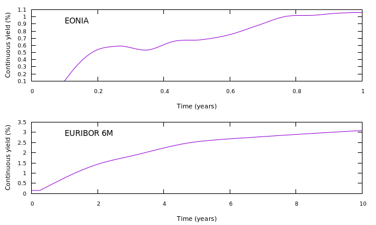
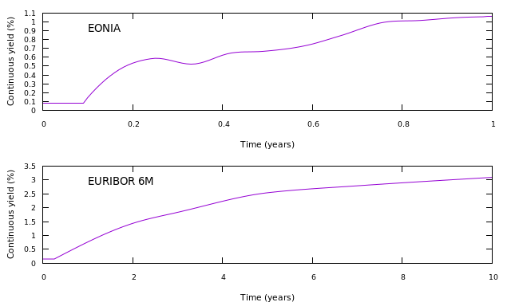

========================================
User-defined nodes for ECB meeting dates
========================================

The code for this example can be found here_.

It is sometimes desirable for curve nodes to be defined independently of the maturity dates of the curves. For example, a curve could be constructed using ECB meeting dates as the node points to gain more insight into the deltas of instruments that are priced using these curves.

This example builds an EONIA curve that is used for discounting EUR payments and to calculate forward overnight rates, and a six-month EURIBOR curve that is used to calculate forward EURIBOR rates. The first set of curves is calculated using the maturity dates of the instruments on the EONIA curve, and the second is calculated using user-supplied node dates.

The process followed is:

* decide on the model to be used
* define the type (shape) of the curves and define the nodes of the curves if not using the instrument maturities
* define the build order and uses of the curves 
* add nodes to the curves
* build

**model**
    The model used for both curves is a discounting model.

.. code-block:: java

        builder = DiscountingMethodCurveBuilder.setUp()

**curve type**

    The EONIA curve (*EONIA*) will be constructed first. This curve will be used as an input to the EURIBOR curve (*EURIBOR 6M*) construction. The EONIA curve is interpolated using a double quadratic method, and the EURIBOR curve is interpolated using a monotonic constrained cubic spline.

    For the curves using instrument maturities, the builder is configured:

.. code-block:: java

        builder = DiscountingMethodCurveBuilder.setUp()
            .buildingFirst("EONIA")
            .using("EONIA").forDiscounting(Currency.EUR).forIndex(EONIA).withInterpolator(INTERPOLATOR_1)
            .thenBuilding("EURIBOR 6M")
            .using("EURIBOR 6M").forIndex(EURIBOR_6M_INDEX).withInterpolator(INTERPOLATOR_2);

    The same interpolators and calculation order are used for the second calculation, but a list of meeting dates is provided:

.. code-block:: java

        builder = DiscountingMethodCurveBuilder.setUp()
            .buildingFirst("EONIA")
            .using("EONIA").forDiscounting(Currency.EUR).forIndex(EONIA).withInterpolator(INTERPOLATOR_1).usingNodeDates(ECB_MEETING_DATES)
            .thenBuilding("EURIBOR 6M")
            .using("EURIBOR 6M").forIndex(EURIBOR_6M_INDEX).withInterpolator(INTERPOLATOR_2);

**add the nodal instruments**

    The instruments used on each curve are:

    * OIS on *EONIA*
    * A 6m EURIBOR deposit and fixed / 6 month EURIBOR swaps on *EURIBOR 6M*

    Curve instrument generators are used:

.. code-block:: java
    
      ois = VanillaOisGenerator.builder()
          .withUnderlyingIndex(EONIA)
          .withPaymentTenor(Tenor.ONE_YEAR)
          .withBusinessDayConvention(BusinessDayConventions.MODIFIED_FOLLOWING)
          .withEndOfMonth(EndOfMonthConvention.ADJUST_FOR_END_OF_MONTH)
          .withPaymentLag(2)
          .withSpotLag(2)
          .withStubType(StubType.SHORT_START)
          .withEndOfMonth(EndOfMonthConvention.IGNORE_END_OF_MONTH)
          .withCalendar(WeekendWorkingDayCalendar.SATURDAY_SUNDAY)
          .build();
      euribor = IborGenerator.builder()
          .withCalendar(WeekendWorkingDayCalendar.SATURDAY_SUNDAY)
          .withIborIndex(EURIBOR_6M_INDEX)
          .build();
      euriborSwap = VanillaFixedIborSwapGenerator.builder()
          .withCalendar(WeekendWorkingDayCalendar.SATURDAY_SUNDAY)
          .withFixedLegDayCount(DayCounts.THIRTY_U_360)
          .withFixedLegPaymentTenor(Tenor.ONE_YEAR)
          .withStub(StubType.SHORT_START)
          .withUnderlyingIndex(EURIBOR_6M_INDEX)
          .build();

The same nodes are added for both calculations. 
    
.. code-block:: java

        IntStream.range(0, OIS_TENORS.length).forEach(
            i -> builder.addNode("EONIA", 
                ois.toCurveInstrument(valuationDate, startTenor, OIS_TENORS[i], 1, OIS_QUOTES[i])));
        builder.addNode("EURIBOR 6M", 
                euribor.toCurveInstrument(valuationDate, startTenor, Tenor.SIX_MONTHS, 1, EURIBOR_6M_QUOTE));
        IntStream.range(0, EURIBOR_6M_SWAP_QUOTES.length).forEach(
            i -> builder.addNode("EURIBOR 6M",
                euriborSwap.toCurveInstrument(valuationDate, startTenor, EURIBOR_6M_SWAP_TENORS[i], 1, EURIBOR_6M_SWAP_QUOTES[i])));

======================

**The code**

.. code-block:: java

  // valuation date/time
  private static final LocalDate VALUATION_DATE = LocalDate.of(2020, 4, 4);
  private static final LocalTime VALUATION_TIME = LocalTime.of(9, 0);
  private static final ZoneId VALUATION_ZONE = ZoneId.of("Europe/London");

  // get the interpolator that will be used for the discounting curves
  private static final Interpolator1D INTERPOLATOR_1 = NamedInterpolator1dFactory.of(
      DoubleQuadraticInterpolator1dAdapter.NAME,
      FlatExtrapolator1dAdapter.NAME,
      LinearExtrapolator1dAdapter.NAME);
  // get the interpolator that will be used for the forward curves
  private static final Interpolator1D INTERPOLATOR_2 = NamedInterpolator1dFactory.of(
      MonotonicConstrainedCubicSplineInterpolator1dAdapter.NAME,
      FlatExtrapolator1dAdapter.NAME,
      LinearExtrapolator1dAdapter.NAME);

  // the underlying index objects for the swaps
  private static final OvernightIndex EONIA = new OvernightIndex("EONIA", Currency.EUR, DayCounts.ACT_360, 0);
  private static final IborTypeIndex EURIBOR_6M_INDEX = new IborTypeIndex("EURIBOR 6M", Currency.EUR, Tenor.SIX_MONTHS, 2, DayCounts.ACT_360,
      BusinessDayConventions.MODIFIED_FOLLOWING, true);

  // discounting curve instruments
  private static final VanillaOisGenerator OIS = VanillaOisGenerator.builder()
      .withUnderlyingIndex(EONIA)
      .withPaymentTenor(Tenor.ONE_YEAR)
      .withBusinessDayConvention(BusinessDayConventions.MODIFIED_FOLLOWING)
      .withEndOfMonth(EndOfMonthConvention.ADJUST_FOR_END_OF_MONTH)
      .withPaymentLag(2)
      .withSpotLag(2)
      .withStubType(StubType.SHORT_START)
      .withEndOfMonth(EndOfMonthConvention.IGNORE_END_OF_MONTH)
      .withCalendar(WeekendWorkingDayCalendar.SATURDAY_SUNDAY)
      .build();
  // 6m curve instruments
  private static final IborGenerator EURIBOR_6M = IborGenerator.builder()
      .withCalendar(WeekendWorkingDayCalendar.SATURDAY_SUNDAY)
      .withIborIndex(EURIBOR_6M_INDEX)
      .build();
  private static final VanillaFixedIborSwapGenerator FIXED_EURIBOR_6M = VanillaFixedIborSwapGenerator.builder()
      .withCalendar(WeekendWorkingDayCalendar.SATURDAY_SUNDAY)
      .withFixedLegDayCount(DayCounts.THIRTY_U_360)
      .withFixedLegPaymentTenor(Tenor.ONE_YEAR)
      .withStub(StubType.SHORT_START)
      .withUnderlyingIndex(EURIBOR_6M_INDEX)
      .build();

  // ECB meeting dates
  private static final LocalDateTime[] ECB_MEETING_DATES = new LocalDateTime[] {
      LocalDateTime.of(2020, 5, 7, 10, 0),
      LocalDateTime.of(2020, 6, 4, 10, 0),
      LocalDateTime.of(2020, 7, 2, 10, 0),
      LocalDateTime.of(2020, 8, 6, 10, 0),
      LocalDateTime.of(2020, 9, 4, 10, 0),
      LocalDateTime.of(2020, 10, 1, 10, 0),
      LocalDateTime.of(2020, 11, 5, 10, 0),
      LocalDateTime.of(2020, 12, 2, 10, 0),
      LocalDateTime.of(2021, 1, 7, 10, 0),
      LocalDateTime.of(2021, 2, 5, 10, 0),
      LocalDateTime.of(2021, 3, 9, 10, 0),
      LocalDateTime.of(2021, 4, 6, 10, 0) };

  private static final double EURIBOR_6M_QUOTE = 0.0015;
  private static final double[] OIS_QUOTES = new double[] {
      0.0010,
      0.0050,
      0.0060,
      0.0054,
      0.0066,
      0.0068,
      0.0075,
      0.0087,
      0.01,
      0.0102,
      0.0105,
      0.0106 };
  private static final double[] EURIBOR_6M_SWAP_QUOTES = new double[] {
      0.0145,
      0.0185,
      0.0255,
      0.0280,
      0.0310
  };
  private static final Tenor[] OIS_TENORS = new Tenor[] {
      Tenor.ONE_MONTH,
      Tenor.TWO_MONTHS,
      Tenor.THREE_MONTHS,
      Tenor.FOUR_MONTHS,
      Tenor.FIVE_MONTHS,
      Tenor.SIX_MONTHS,
      Tenor.SEVEN_MONTHS,
      Tenor.EIGHT_MONTHS,
      Tenor.NINE_MONTHS,
      Tenor.TEN_MONTHS,
      Tenor.ELEVEN_MONTHS,
      Tenor.ONE_YEAR };
  private static final Tenor[] EURIBOR_6M_SWAP_TENORS = new Tenor[] {
      Tenor.TWO_YEARS,
      Tenor.THREE_YEARS,
      Tenor.FIVE_YEARS,
      Tenor.SEVEN_YEARS,
      Tenor.TEN_YEARS };

  // the curve names
  private static final String DISCOUNTING_NAME = "EONIA";
  private static final String FWD6_NAME = "EURIBOR 6M";

  public static void constructCurvesUsingMeetingDates(final PrintStream out) {
    final ZonedDateTime valuationDate = ZonedDateTime.of(VALUATION_DATE, VALUATION_TIME, VALUATION_ZONE);
    // first construct the builder
    // build the discounting / overnight curve first, using ECB meeting dates as nodes
    // then build the 6m EURIBOR curve
    final DiscountingMethodCurveSetUp curveBuilder = DiscountingMethodCurveBuilder.setUp()
        .buildingFirst(DISCOUNTING_NAME)
        .using(DISCOUNTING_NAME).forDiscounting(Currency.EUR).forIndex(EONIA).withInterpolator(INTERPOLATOR_1).usingNodeDates(ECB_MEETING_DATES)
        .thenBuilding(FWD6_NAME)
        .using(FWD6_NAME).forIndex(EURIBOR_6M_INDEX).withInterpolator(INTERPOLATOR_2);
    final Tenor startTenor = Tenor.of(Period.ZERO);
    // add the discounting curve nodes
    IntStream.range(0, OIS_TENORS.length).forEach(
        i -> curveBuilder.addNode(DISCOUNTING_NAME, OIS.toCurveInstrument(valuationDate, startTenor, OIS_TENORS[i], 1, OIS_QUOTES[i])));
    // add the EURIBOR curve nodes
    curveBuilder.addNode(FWD6_NAME, EURIBOR_6M.toCurveInstrument(valuationDate, startTenor, Tenor.SIX_MONTHS, 1, EURIBOR_6M_QUOTE));
    IntStream.range(0, EURIBOR_6M_SWAP_QUOTES.length).forEach(
        i -> curveBuilder.addNode(FWD6_NAME,
            FIXED_EURIBOR_6M.toCurveInstrument(valuationDate, startTenor, EURIBOR_6M_SWAP_TENORS[i], 1, EURIBOR_6M_SWAP_QUOTES[i])));
    // build the curves
    final Pair<MulticurveProviderDiscount, CurveBuildingBlockBundle> result = curveBuilder.getBuilder().buildCurves(valuationDate);
  }

  public static void constructCurves(final PrintStream out) {
    final ZonedDateTime valuationDate = ZonedDateTime.of(VALUATION_DATE, VALUATION_TIME, VALUATION_ZONE);
    // first construct the builder
    // build the discounting / overnight curve first,
    // then build the 6m EURIBOR curve
    final DiscountingMethodCurveSetUp curveBuilder = DiscountingMethodCurveBuilder.setUp()
        .buildingFirst(DISCOUNTING_NAME)
        .using(DISCOUNTING_NAME).forDiscounting(Currency.EUR).forIndex(EONIA).withInterpolator(INTERPOLATOR_1)
        .thenBuilding(FWD6_NAME)
        .using(FWD6_NAME).forIndex(EURIBOR_6M_INDEX).withInterpolator(INTERPOLATOR_2);
    final Tenor startTenor = Tenor.of(Period.ZERO);
    // add the discounting curve nodes
    IntStream.range(0, OIS_TENORS.length).forEach(
        i -> curveBuilder.addNode(DISCOUNTING_NAME, OIS.toCurveInstrument(valuationDate, startTenor, OIS_TENORS[i], 1, OIS_QUOTES[i])));
    // add the EURIBOR curve nodes
    curveBuilder.addNode(FWD6_NAME, EURIBOR_6M.toCurveInstrument(valuationDate, startTenor, Tenor.SIX_MONTHS, 1, EURIBOR_6M_QUOTE));
    IntStream.range(0, EURIBOR_6M_SWAP_QUOTES.length).forEach(
        i -> curveBuilder.addNode(FWD6_NAME,
            FIXED_EURIBOR_6M.toCurveInstrument(valuationDate, startTenor, EURIBOR_6M_SWAP_TENORS[i], 1, EURIBOR_6M_SWAP_QUOTES[i])));
    // build the curves
    final Pair<MulticurveProviderDiscount, CurveBuildingBlockBundle> result = curveBuilder.getBuilder().buildCurves(valuationDate);
  }

========================

**The output**

The curves generated using the instrument maturities are:

|node curve plot|

and the curves generated using ECB meeting dates for the EONIA curve are:

|meeting date curve plot|

The yields at the nodes for each curve are shown below.

*EONIA*

=======   ===================    ==================    ===========================   ===============================
node      time (node) (years)     yield (node) (%)     time (meeting date) (years)   yield (meeting date) (%) 
=======   ===================    ==================    ===========================   ===============================
1          0.101093	              0.101662                      0.090164                        0.082338		
2          0.180328	              0.491713	                    0.166667                        0.448892		
3          0.262295	              0.589069	                    0.243169                        0.585479		
4          0.352459	              0.535759	                    0.338798                        0.524146		
5          0.431694	              0.658274	                    0.418033                        0.647419		
6          0.513661	              0.678905	                    0.491803                        0.667920		
7          0.601093	              0.752005	                    0.587432                        0.735191		
8          0.680328	              0.873474	                    0.661202                        0.842331		
9          0.770567	              1.007103	                    0.759608                        0.997203		
10         0.850019	              1.020883	                    0.839060                        1.017142		
11         0.926731	              1.051151	                    0.926731                        1.050877		
12         1.011663                1.060543                      1.003443                        1.060411
=======   ===================    ==================    ===========================   ===============================

*EURIBOR 6M*

=======   ===================    ==================    ===========================   ===============================
node      time (node) (years)     yield (node) (%)     time (meeting date) (years)   yield (meeting date) (%) 
=======   ===================    ==================    ===========================   ===============================
1           0.510929	               0.152442	               0.510929                     0.152442		
2           2.008923	               1.438453	               2.008923                     1.438523		
3           3.014402	             1.837167                 3.014402                     1.837369		
4           5.008923	               2.534440            	 5.008923                      2.535899		
5           7.008923	               2.783500	               7.008923                    2.785508		
6           10.008923               3.082924                10.008923                   3.087682
=======   ===================    ==================    ===========================   ===============================

As expected, the node times for the EONIA curve are different, as are the calculated yields. The EURIBOR curves are slightly
different, as the EONIA curve is used when pricing the curve instruments.

.. _here: https://github.com/McLeodMoores/starling/blob/curve/projects/analytics/src/main/java/com/mcleodmoores/analytics/examples/curveconstruction/EcbMeetingtCurveExample.java

