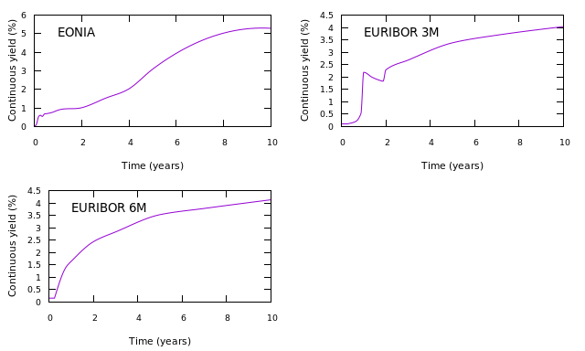

=============================================
A multi-curve EONIA and EURIBOR example
=============================================

The code for this example can be found here_.

This example builds an EONIA curve that is used for discounting EUR payments and to calculate forward overnight rates, and a three-month and six-month EURIBOR curve that will calculate the appropriate forward EURIBOR rates.
Two models are used to compare the difference between using a convexity adjustment (via a one-factor Hull-White model) and no adjustment.

* decide on the model to be used
* define the type (shape) of the curves
* define the build order and uses of the curves 
* add nodes to the curves
* build

**model**
    Two models will be used to compare outputs: a one-factor Hull-White model and a discounting model with no convexity adjustment. In both cases, the root finder finds the spread over the fixed rates of the curve instruments that mean they price to zero.

    The discounting model is set up using

.. code-block:: java

    builder = DiscountingMethodCurveBuilder.setUp();

and the Hull-White model is set up using

.. code-block:: java

    hwBuilder = HullWhiteMethodCurveBuilder.setUp()
        .addHullWhiteParameters(MODEL_PARAMETERS)
        .forHullWhiteCurrency(Currency.EUR);

The model parameters describe the mean reversion speed and piecewise constant volatility structure. In this example, the values are exaggerated to illustrate the differences between the models.

**curve shape**
    The EONIA curve will be interpolated using a double quadratic, while both EURIBOR curves will use a monotonic constrained cubic spline. These two interpolators use flat extrapolation on the left and linear extrapolation on the right

.. code-block:: java

      eoniaInterpolator = NamedInterpolator1dFactory.of(
          DoubleQuadraticInterpolator1dAdapter.NAME,
          FlatExtrapolator1dAdapter.NAME,
          LinearExtrapolator1dAdapter.NAME);

      euriborInterpolator = NamedInterpolator1dFactory.of(
          MonotonicConstrainedCubicSplineInterpolator1dAdapter.NAME,
          FlatExtrapolator1dAdapter.NAME,
          LinearExtrapolator1dAdapter.NAME);

**curve use**
    Three curves will be created:
    
    * An EONIA curve *EONIA* that will be used to discount any EUR payments and to calculate forward overnight rates
    * A 3 month EURIBOR curve *EURIBOR 3M* that will be used to calculate forward rates for the 3m EURIBOR index
    * A 6 month EURIBOR curve *EURIBOR 6M* that will be used to calculate forward rates for the 6m EURIBOR index

    The EONIA curve will be constructed first, then the 3M EURIBOR curve, then the 6M EURIBOR curve. This is possible because the 3M curve only has a dependency on the EONIA curve, and the 6M curve only has a dependency on the EONIA curve. If 3Mx6M basis swaps were used, the two EURIBOR curves would have to be constructed at the same time. For a detailed explanation of what the difference is between building the curves simultaneously and building them consecutively, please look at this example_.

    First, the building order is defined:

    .. code-block:: java
    
        hwBuilder
            .buildingFirst("EONIA")
            .thenBuilding("EURIBOR 3M")
            .thenBuilding("EURIBOR 6M")
    
    Then, the use and shape of each curve is set:
    
    .. code-block:: java
    
        hwBuilder
            .using("EONIA").forDiscounting(Currency.EUR).forIndex(EONIA).withInterpolator(eoniaInterpolator)
            .using("EURIBOR 3M").forIndex(EURIBOR_3M_INDEX).withInterpolator(euriborInterpolator)
            .using("EURIBOR 6M").forIndex(EURIBOR_6M_INDEX).withInterpolator(euriborInterpolator);
    
    Similarly, the discounting curve is set up:

    .. code-block:: java
    
        builder = DiscountingMethodCurveBuilder.setUp()
            .buildingFirst("EONIA")
            .thenBuilding("EURIBOR 3M")
            .thenBuilding("EURIBOR 6M")
            .using("EONIA").forDiscounting(Currency.EUR).forIndex(EONIA).withInterpolator(eoniaInterpolator)
            .using("EURIBOR 3M").forIndex(EURIBOR_3M_INDEX).withInterpolator(euriborInterpolator)
            .using("EURIBOR 6M").forIndex(EURIBOR_6M_INDEX).withInterpolator(euriborInterpolator);
            

**add the nodal instruments**

    The instruments used on each curve are:

    * An overnight deposit and OIS on *EONIA*
    * A 3m EURIBOR deposit, the 2nd, 3rd, 5th, 6th and 7th short-term interest rate futures, and fixed / 3 month EURIBOR swaps on *EURIBOR 3M*
    * A 6m EURIBOR deposit, 3x9 and 6x12 FRAs, and fixed / 6 month EURIBOR swaps on *EURIBOR 6M*

    Curve instrument generators are used to create the instruments:
    
    .. code-block:: java
    
      overnight = OvernightDepositGenerator.builder()
          .withCurrency(Currency.EUR)
          .withCalendar(WeekendWorkingDayCalendar.SATURDAY_SUNDAY)
          .withDayCount(DayCounts.ACT_360)
          .build();
          
      ois = VanillaOisGenerator.builder()
          .withUnderlyingIndex(EONIA)
          .withPaymentTenor(Tenor.ONE_YEAR)
          .withBusinessDayConvention(BusinessDayConventions.MODIFIED_FOLLOWING)
          .withEndOfMonth(EndOfMonthConvention.ADJUST_FOR_END_OF_MONTH)
          .withPaymentLag(2)
          .withSpotLag(2)
          .withStubType(StubType.SHORT_START)
          .withEndOfMonth(EndOfMonthConvention.IGNORE_END_OF_MONTH)
          .withCalendar(WeekendWorkingDayCalendar.SATURDAY_SUNDAY)
          .build();
          
      euribor3m = IborGenerator.builder()
          .withCalendar(WeekendWorkingDayCalendar.SATURDAY_SUNDAY)
          .withIborIndex(EURIBOR_3M_INDEX)
          .build();
          
      quarterlyFuture = QuarterlyStirFutureGenerator.builder()
          .withCalendar(WeekendWorkingDayCalendar.SATURDAY_SUNDAY)
          .withIborIndex(EURIBOR_3M_INDEX)
          .withPaymentAccrualFactor(0.25)
          .build();
          
      fixedEuribor3mSwap = VanillaFixedIborSwapGenerator.builder()
          .withCalendar(WeekendWorkingDayCalendar.SATURDAY_SUNDAY)
          .withFixedLegDayCount(DayCounts.THIRTY_U_360)
          .withFixedLegPaymentTenor(Tenor.ONE_YEAR)
          .withStub(StubType.SHORT_START)
          .withUnderlyingIndex(EURIBOR_3M_INDEX)
          .build();
          
      euribor6m = IborGenerator.builder()
          .withCalendar(WeekendWorkingDayCalendar.SATURDAY_SUNDAY)
          .withIborIndex(EURIBOR_6M_INDEX)
          .build();
          
      euribor6mFra = FraGenerator.builder()
          .withCalendar(WeekendWorkingDayCalendar.SATURDAY_SUNDAY)
          .withIborIndex(EURIBOR_6M_INDEX)
          .build();
          
      fixedEuribor6mSwap = VanillaFixedIborSwapGenerator.builder()
          .withCalendar(WeekendWorkingDayCalendar.SATURDAY_SUNDAY)
          .withFixedLegDayCount(DayCounts.THIRTY_U_360)
          .withFixedLegPaymentTenor(Tenor.ONE_YEAR)
          .withStub(StubType.SHORT_START)
          .withUnderlyingIndex(EURIBOR_6M_INDEX)
          .build();
    
    Adding the nodes to the discounting curve:
    
    .. code-block:: java
    
        builder.addNode("EONIA", overnight.toCurveInstrument(valuationDate, startTenor, Tenor.ON, 1, OVERNIGHT_QUOTE));
        IntStream.range(0, OIS_TENORS.length).forEach(
            i -> builder.addNode("EONIA", ois.toCurveInstrument(valuationDate, startTenor, OIS_TENORS[i], 1, OIS_QUOTES[i])));
    
        hwBuilder.addNode("EONIA", overnight.toCurveInstrument(valuationDate, startTenor, Tenor.ON, 1, OVERNIGHT_QUOTE));
        IntStream.range(0, OIS_TENORS.length).forEach(
            i -> hwBuilder.addNode("EONIA", ois.toCurveInstrument(valuationDate, startTenor, OIS_TENORS[i], 1, OIS_QUOTES[i])));
    
    The nodes for the 3m and 6m EURIBOR curves are added in the same way.
    
=======================

**The code**

.. code-block:: java

  // valuation date/time
  private static final LocalDate VALUATION_DATE = LocalDate.now();
  private static final LocalTime VALUATION_TIME = LocalTime.of(9, 0);
  private static final ZoneId VALUATION_ZONE = ZoneId.of("Europe/London");

  // get the interpolator that will be used for the discounting curves
  private static final Interpolator1D INTERPOLATOR_1 = NamedInterpolator1dFactory.of(
      DoubleQuadraticInterpolator1dAdapter.NAME,
      FlatExtrapolator1dAdapter.NAME,
      LinearExtrapolator1dAdapter.NAME);
  // get the interpolator that will be used for the forward curves
  private static final Interpolator1D INTERPOLATOR_2 = NamedInterpolator1dFactory.of(
      MonotonicConstrainedCubicSplineInterpolator1dAdapter.NAME,
      FlatExtrapolator1dAdapter.NAME,
      LinearExtrapolator1dAdapter.NAME);

  // the underlying index objects for the swaps
  private static final OvernightIndex EONIA = new OvernightIndex("EONIA", Currency.EUR, DayCounts.ACT_360, 0);
  private static final IborTypeIndex EURIBOR_3M_INDEX = new IborTypeIndex("EURIBOR 3M", Currency.EUR, Tenor.THREE_MONTHS, 2, DayCounts.ACT_360,
      BusinessDayConventions.MODIFIED_FOLLOWING, true);
  private static final IborTypeIndex EURIBOR_6M_INDEX = new IborTypeIndex("EURIBOR 6M", Currency.EUR, Tenor.SIX_MONTHS, 2, DayCounts.ACT_360,
      BusinessDayConventions.MODIFIED_FOLLOWING, true);

  // discounting curve instruments
  private static final OvernightDepositGenerator OVERNIGHT = OvernightDepositGenerator.builder()
      .withCurrency(Currency.EUR)
      .withCalendar(WeekendWorkingDayCalendar.SATURDAY_SUNDAY)
      .withDayCount(DayCounts.ACT_360)
      .build();
  private static final VanillaOisGenerator OIS = VanillaOisGenerator.builder()
      .withUnderlyingIndex(EONIA)
      .withPaymentTenor(Tenor.ONE_YEAR)
      .withBusinessDayConvention(BusinessDayConventions.MODIFIED_FOLLOWING)
      .withEndOfMonth(EndOfMonthConvention.ADJUST_FOR_END_OF_MONTH)
      .withPaymentLag(2)
      .withSpotLag(2)
      .withStubType(StubType.SHORT_START)
      .withEndOfMonth(EndOfMonthConvention.IGNORE_END_OF_MONTH)
      .withCalendar(WeekendWorkingDayCalendar.SATURDAY_SUNDAY)
      .build();
  // 3m curve instruments
  private static final IborGenerator EURIBOR_3M = IborGenerator.builder()
      .withCalendar(WeekendWorkingDayCalendar.SATURDAY_SUNDAY)
      .withIborIndex(EURIBOR_3M_INDEX)
      .build();
  private static final QuarterlyStirFutureGenerator EURIBOR_QUARTERLY_FUT = QuarterlyStirFutureGenerator.builder()
      .withCalendar(WeekendWorkingDayCalendar.SATURDAY_SUNDAY)
      .withIborIndex(EURIBOR_3M_INDEX)
      .withPaymentAccrualFactor(0.25)
      .build();
  private static final VanillaFixedIborSwapGenerator FIXED_EURIBOR_3M = VanillaFixedIborSwapGenerator.builder()
      .withCalendar(WeekendWorkingDayCalendar.SATURDAY_SUNDAY)
      .withFixedLegDayCount(DayCounts.THIRTY_U_360)
      .withFixedLegPaymentTenor(Tenor.ONE_YEAR)
      .withStub(StubType.SHORT_START)
      .withUnderlyingIndex(EURIBOR_3M_INDEX)
      .build();
  // 6m curve instruments
  private static final IborGenerator EURIBOR_6M = IborGenerator.builder()
      .withCalendar(WeekendWorkingDayCalendar.SATURDAY_SUNDAY)
      .withIborIndex(EURIBOR_6M_INDEX)
      .build();
  private static final FraGenerator EURIBOR_6M_FRA = FraGenerator.builder()
      .withCalendar(WeekendWorkingDayCalendar.SATURDAY_SUNDAY)
      .withIborIndex(EURIBOR_6M_INDEX)
      .build();
  private static final VanillaFixedIborSwapGenerator FIXED_EURIBOR_6M = VanillaFixedIborSwapGenerator.builder()
      .withCalendar(WeekendWorkingDayCalendar.SATURDAY_SUNDAY)
      .withFixedLegDayCount(DayCounts.THIRTY_U_360)
      .withFixedLegPaymentTenor(Tenor.ONE_YEAR)
      .withStub(StubType.SHORT_START)
      .withUnderlyingIndex(EURIBOR_6M_INDEX)
      .build();

  private static final double OVERNIGHT_QUOTE = 0.0005;
  private static final double EURIBOR_3M_QUOTE = 0.001;
  private static final double EURIBOR_6M_QUOTE = 0.0015;
  private static final double[] OIS_QUOTES = new double[] {
      0.0010,
      0.0050,
      0.0060,
      0.0054,
      0.0066,
      0.0068,
      0.0075,
      0.0087,
      0.01,
      0.015,
      0.02,
      0.03,
      0.05 };
  private static final double[] EURIBOR_FUT_QUOTES = new double[] {
      0.997,
      0.9865,
      0.9875,
      0.9865,
      0.9860,
      0.9860,
  };
  private static final double[] EURIBOR_3M_SWAP_QUOTES = new double[] {
      0.0220,
      0.0230,
      0.0270,
      0.0340,
      0.0370,
      0.0400 };
  private static final double[] EURIBOR_6M_FRA_QUOTES = new double[] {
      0.024,
      0.024
  };
  private static final double[] EURIBOR_6M_SWAP_QUOTES = new double[] {
      0.0245,
      0.0285,
      0.0355,
      0.0380,
      0.0410
  };
  private static final Tenor[] OIS_TENORS = new Tenor[] {
      Tenor.ONE_MONTH,
      Tenor.TWO_MONTHS,
      Tenor.THREE_MONTHS,
      Tenor.FOUR_MONTHS,
      Tenor.FIVE_MONTHS,
      Tenor.SIX_MONTHS,
      Tenor.NINE_MONTHS,
      Tenor.ONE_YEAR,
      Tenor.TWO_YEARS,
      Tenor.THREE_YEARS,
      Tenor.FOUR_YEARS,
      Tenor.FIVE_YEARS,
      Tenor.TEN_YEARS };
  private static final int[] EURIBOR_N_FUTURE = new int[] {
      2,
      3,
      5,
      6,
      7
  };
  private static final Tenor[] EURIBOR_3M_SWAP_TENORS = new Tenor[] {
      Tenor.ONE_YEAR,
      Tenor.TWO_YEARS,
      Tenor.THREE_YEARS,
      Tenor.FIVE_YEARS,
      Tenor.SEVEN_YEARS,
      Tenor.TEN_YEARS };
  private static final Tenor[] EURIBOR_6M_FRA_TENORS = new Tenor[] {
      Tenor.NINE_MONTHS,
      Tenor.TWELVE_MONTHS
  };
  private static final Tenor[] EURIBOR_6M_SWAP_TENORS = new Tenor[] {
      Tenor.TWO_YEARS,
      Tenor.THREE_YEARS,
      Tenor.FIVE_YEARS,
      Tenor.SEVEN_YEARS,
      Tenor.TEN_YEARS };

  // the Hull-White model parameters
  private static final double MEAN_REVERSION = 0.01;
  private static final double[] VOLATILITY_LEVELS = new double[] { 0.05, 0.051, 0.052, 0.053, 0.0514 };
  private static final double[] VOLATILITY_TIME = new double[] { 0.5, 1.0, 2.0, 5.0 };
  private static final HullWhiteOneFactorPiecewiseConstantParameters MODEL_PARAMETERS = new HullWhiteOneFactorPiecewiseConstantParameters(
      MEAN_REVERSION, VOLATILITY_LEVELS, VOLATILITY_TIME);

  // the curve names
  private static final String DISCOUNTING_NAME = "EONIA";
  private static final String FWD3_NAME = "EURIBOR 3M";
  private static final String FWD6_NAME = "EURIBOR 6M";

  public static void constructCurvesWithAdjustment(final PrintStream out) {
    final ZonedDateTime valuationDate = ZonedDateTime.of(VALUATION_DATE, VALUATION_TIME, VALUATION_ZONE);
    final HullWhiteMethodCurveSetUp builder = HullWhiteMethodCurveBuilder.setUp()
        .addHullWhiteParameters(MODEL_PARAMETERS)
        .forHullWhiteCurrency(Currency.EUR)
        .buildingFirst(DISCOUNTING_NAME)
        .thenBuilding(FWD3_NAME)
        .thenBuilding(FWD6_NAME)
        .using(DISCOUNTING_NAME).forDiscounting(Currency.EUR).forIndex(EONIA).withInterpolator(INTERPOLATOR_1)
        .using(FWD3_NAME).forIndex(EURIBOR_3M_INDEX).withInterpolator(INTERPOLATOR_2)
        .using(FWD6_NAME).forIndex(EURIBOR_6M_INDEX).withInterpolator(INTERPOLATOR_2);
    final Tenor startTenor = Tenor.of(Period.ZERO);

    // add nodes to the discounting curve
    builder.addNode(DISCOUNTING_NAME, OVERNIGHT.toCurveInstrument(valuationDate, startTenor, Tenor.ON, 1, OVERNIGHT_QUOTE));
    IntStream.range(0, OIS_TENORS.length).forEach(
        i -> builder.addNode(DISCOUNTING_NAME, OIS.toCurveInstrument(valuationDate, startTenor, OIS_TENORS[i], 1, OIS_QUOTES[i])));

    // add nodes to the 3m forward curve
    builder.addNode(FWD3_NAME, EURIBOR_3M.toCurveInstrument(valuationDate, startTenor, Tenor.THREE_MONTHS, 1, EURIBOR_3M_QUOTE));
    IntStream.range(0, EURIBOR_N_FUTURE.length).forEach(
        i -> builder.addNode(FWD3_NAME, EURIBOR_QUARTERLY_FUT.toCurveInstrument(valuationDate, EURIBOR_N_FUTURE[i], 1, EURIBOR_FUT_QUOTES[i])));
    IntStream.range(0, EURIBOR_3M_SWAP_TENORS.length).forEach(
        i -> builder.addNode(FWD3_NAME,
            FIXED_EURIBOR_3M.toCurveInstrument(valuationDate, startTenor, EURIBOR_3M_SWAP_TENORS[i], 1, EURIBOR_3M_SWAP_QUOTES[i])));

    // add nodes to the 6m forward curve
    builder.addNode(FWD6_NAME, EURIBOR_6M.toCurveInstrument(valuationDate, startTenor, Tenor.SIX_MONTHS, 1, EURIBOR_6M_QUOTE));
    IntStream.range(0, EURIBOR_6M_FRA_TENORS.length).forEach(
        i -> builder.addNode(FWD6_NAME, EURIBOR_6M_FRA.toCurveInstrument(valuationDate, startTenor, EURIBOR_6M_FRA_TENORS[i], 1, EURIBOR_6M_FRA_QUOTES[i])));
    IntStream.range(0, EURIBOR_6M_SWAP_TENORS.length).forEach(
        i -> builder.addNode(FWD6_NAME,
            FIXED_EURIBOR_6M.toCurveInstrument(valuationDate, startTenor, EURIBOR_6M_SWAP_TENORS[i], 1, EURIBOR_6M_SWAP_QUOTES[i])));

    // build the curves
    final Pair<HullWhiteOneFactorProviderDiscount, CurveBuildingBlockBundle> result = builder.getBuilder().buildCurves(valuationDate);
  }

  public static void constructCurvesWithoutAdjustment(final PrintStream out) {
    final ZonedDateTime valuationDate = ZonedDateTime.of(VALUATION_DATE, VALUATION_TIME, VALUATION_ZONE);
    final DiscountingMethodCurveSetUp builder = DiscountingMethodCurveBuilder.setUp()
        .buildingFirst(DISCOUNTING_NAME)
        .thenBuilding(FWD3_NAME)
        .thenBuilding(FWD6_NAME)
        .using(DISCOUNTING_NAME).forDiscounting(Currency.EUR).forIndex(EONIA).withInterpolator(INTERPOLATOR_1)
        .using(FWD3_NAME).forIndex(EURIBOR_3M_INDEX).withInterpolator(INTERPOLATOR_2)
        .using(FWD6_NAME).forIndex(EURIBOR_6M_INDEX).withInterpolator(INTERPOLATOR_2);
    final Tenor startTenor = Tenor.of(Period.ZERO);

    // add nodes to the discounting curve
    builder.addNode(DISCOUNTING_NAME, OVERNIGHT.toCurveInstrument(valuationDate, startTenor, Tenor.ON, 1, OVERNIGHT_QUOTE));
    IntStream.range(0, OIS_TENORS.length).forEach(
        i -> builder.addNode(DISCOUNTING_NAME, OIS.toCurveInstrument(valuationDate, startTenor, OIS_TENORS[i], 1, OIS_QUOTES[i])));

    // add nodes to the 3m forward curve
    builder.addNode(FWD3_NAME, EURIBOR_3M.toCurveInstrument(valuationDate, startTenor, Tenor.THREE_MONTHS, 1, EURIBOR_3M_QUOTE));
    IntStream.range(0, EURIBOR_N_FUTURE.length).forEach(
        i -> builder.addNode(FWD3_NAME, EURIBOR_QUARTERLY_FUT.toCurveInstrument(valuationDate, EURIBOR_N_FUTURE[i], 1, EURIBOR_FUT_QUOTES[i])));
    IntStream.range(0, EURIBOR_3M_SWAP_TENORS.length).forEach(
        i -> builder.addNode(FWD3_NAME,
            FIXED_EURIBOR_3M.toCurveInstrument(valuationDate, startTenor, EURIBOR_3M_SWAP_TENORS[i], 1, EURIBOR_3M_SWAP_QUOTES[i])));

    // add nodes to the 6m forward curve
    builder.addNode(FWD6_NAME, EURIBOR_6M.toCurveInstrument(valuationDate, startTenor, Tenor.SIX_MONTHS, 1, EURIBOR_6M_QUOTE));
    IntStream.range(0, EURIBOR_6M_FRA_TENORS.length).forEach(
        i -> builder.addNode(FWD6_NAME, EURIBOR_6M_FRA.toCurveInstrument(valuationDate, startTenor, EURIBOR_6M_FRA_TENORS[i], 1, EURIBOR_6M_FRA_QUOTES[i])));
    IntStream.range(0, EURIBOR_6M_SWAP_TENORS.length).forEach(
        i -> builder.addNode(FWD6_NAME,
            FIXED_EURIBOR_6M.toCurveInstrument(valuationDate, startTenor, EURIBOR_6M_SWAP_TENORS[i], 1, EURIBOR_6M_SWAP_QUOTES[i])));

    // build the curves
    final Pair<MulticurveProviderDiscount, CurveBuildingBlockBundle> result = builder.getBuilder().buildCurves(valuationDate);
  }

====================

**The output**

The curves generated using the Hull-White model are:

|HW curve plot|

For comparison, the curves generated without convexity adjustment are:

|curve plot|

The yields at the nodes are shown in the tables below. As would be expected, the *EONIA* and *EURIBOR 6M* 
curves are identical for both models. This is because the 6M curve only depends on the *EONIA* curve, 
and neither contain any futures (i.e. the instruments that will have a convexity adjustment applied).

*EONIA*

=======   =============    =========================    ===============================
node      time (years)     yield: no adjustment (%)     yield: convexity adjustment (%) 
=======   =============    =========================    ===============================
1           0.002732	       0.050833                    0.050833	
2           0.095628	       0.120803                    0.120803
3           0.174863	       0.502245                    0.502245
4           0.256831	       0.598293                    0.598293	
5           0.346995	       0.541722                    0.541722
6           0.426230	       0.664704                    0.664704
7           0.508197	       0.683801                    0.683801
8           0.765259        0.758154                    0.758154
9           1.006355        0.876471                    0.876471	
10          2.011835        1.010370                    1.010370	
11          3.009095	       1.520295                    1.520295	
12          4.008197        2.032245	                   2.032245	
13          5.006355	       3.091563                    3.091563
14          10.006355       5.288720                    5.288720
=======   =============    =========================    ===============================

*EURIBOR 3M*

=======   =============    =========================    ===============================
node      time (years)     yield: no adjustment (%)     yield: convexity adjustment (%) 
=======   =============    =========================    ===============================
1           0.254098	           0.101654                    0.101654		
2           0.636612	           0.175119                    0.194898		
3           0.883068	           0.482887                    0.522051		
4           1.006355	           2.187787                    2.187871		
5           1.387177	           1.937512                    1.986987		
6           1.633753            1.801656                   1.893323			
7           1.880328            1.693622                    1.830857			
8           2.003616            2.283950                    2.284695			
9           3.000876            2.679565                    2.680090			
10          5.003616            3.380333                    3.380648			
11          7.006355            3.690184                    3.690409			
12          10.003616           4.036491                    4.036649
=======   =============    =========================    ===============================

*EURIBOR 6M*

=======   =============    =========================    ===============================
node      time (years)     yield: no adjustment (%)     yield: convexity adjustment (%) 
=======   =============    =========================    ===============================
1           0.254098	           0.152442                    0.152442		
2           0.757040	           1.661655                    1.661655			
3           1.003616            1.278463                    1.278463			
4           2.003616            2.427799                    2.427799			
5           3.000876            2.823405                    2.823405			
6           5.003616            3.526724                    3.526724			
7           7.006355            3.785479                    3.785479			
8           10.003616           4.136382                    4.136382
=======   =============    =========================    ===============================

The shape of the inverse Jacobian matrix is shown below, with non-zero sensitivities marked with **X**.

Some observations:

    * As the curves are constructed consecutively, *EONIA* only has calculated sensitivities to itself, *EURIBOR 3M* has calculated sensitivities to itself and *EONIA*, and *EURIBOR 6M* has sensitivities to all curves
    * As the first node of the *EURIBOR 3M(6M)* curve is at 3(6) months, there are no / very small sensitivities to any instruments with smaller tenor in the *EONIA* curve. 
    * The shapes of the matrices are approximately lower-triangular, i.e. a lower-tenor instrument has no sensitivity to a higher-tenor instrument. The interpolator is not completely local, however, so the sensitivities can be distributed over adjacent nodes
    * The *EURIBOR 6M* curve has no sensitivity to any of the instruments in the *EURIBOR 3M* curve. This is because there are no basis swaps in either curve

.. raw:: html

    
    <table border="1" class="docutils">
    <colgroup>
    <col width="3%" />
    <col width="3%" />
    <col width="3%" />
    <col width="3%" />
    <col width="3%" />
    <col width="3%" />
    <col width="3%" />
    <col width="3%" />
    <col width="3%" />
    <col width="3%" />
    <col width="3%" />
    <col width="3%" />
    <col width="3%" />
    <col width="3%" />
    <col width="3%" />
    <col width="3%" />
    <col width="3%" />
    <col width="3%" />
    <col width="3%" />
    <col width="3%" />
    <col width="3%" />
    <col width="3%" />
    <col width="3%" />
    <col width="3%" />
    <col width="3%" />
    <col width="3%" />
    <col width="3%" />
    <col width="3%" />
    <col width="3%" />
    <col width="3%" />
    <col width="3%" />
    <col width="3%" />
    <col width="3%" />
    <col width="3%" />
    </colgroup>
    <thead valign="bottom">
    <tr><th class="head"></th>
    <th colspan="14" class="head">EONIA</th>
    <th colspan="12" class="head">EURIBOR 3M</th>
    <th colspan="8" class="head">EURIBOR 6M</th>
    </tr>
    <tr>
    <td></td>
    <td><b>1</b></td>
    <td><b>2</b></td>
    <td><b>3</b></td>
    <td><b>4</b></td>
    <td><b>5</b></td>
    <td><b>6</b></td>
    <td><b>7</b></td>
    <td><b>8</b></td>
    <td><b>9</b></td>
    <td><b>10</b></td>
    <td><b>11</b></td>
    <td><b>12</b></td>
    <td><b>13</b></td>
    <td><b>14</b></td>
    <td><b>1</b></td>
    <td><b>2</b></td>
    <td><b>3</b></td>
    <td><b>4</b></td>
    <td><b>5</b></td>
    <td><b>6</b></td>
    <td><b>7</b></td>
    <td><b>8</b></td>
    <td><b>9</b></td>
    <td><b>10</b></td>
    <td><b>11</b></td>
    <td><b>12</b></td>
    <td><b>1</b></td>
    <td><b>2</b></td>
    <td><b>3</b></td>
    <td><b>4</b></td>
    <td><b>5</b></td>
    <td><b>6</b></td>
    <td><b>7</b></td>
    <td><b>8</b></td>
    </tr>
    </thead>
    <tbody valign="top">
    <tr><td>CASH 1D</td>
    <td>X</td>
    <td>0</td>
    <td>0</td>
    <td>0</td>
    <td>0</td>
    <td>0</td>
    <td>0</td>
    <td>0</td>
    <td>0</td>
    <td>0</td>
    <td>0</td>
    <td>0</td>
    <td>0</td>
    <td>0</td>
    <td>&nbsp;</td>
    <td>&nbsp;</td>
    <td>&nbsp;</td>
    <td>&nbsp;</td>
    <td>&nbsp;</td>
    <td>&nbsp;</td>
    <td>&nbsp;</td>
    <td>&nbsp;</td>
    <td>&nbsp;</td>
    <td>&nbsp;</td>
    <td>&nbsp;</td>
    <td>&nbsp;</td>
    <td>&nbsp;</td>
    <td>&nbsp;</td>
    <td>&nbsp;</td>
    <td>&nbsp;</td>
    <td>&nbsp;</td>
    <td>&nbsp;</td>
    <td>&nbsp;</td>
    <td>&nbsp;</td>
    </tr>
    <tr><td>OIS 1M</td>
    <td>X</td>
    <td>X</td>
    <td>X</td>
    <td>X</td>
    <td>X</td>
    <td>0</td>
    <td>0</td>
    <td>0</td>
    <td>0</td>
    <td>0</td>
    <td>0</td>
    <td>0</td>
    <td>0</td>
    <td>0</td>
    <td>&nbsp;</td>
    <td>&nbsp;</td>
    <td>&nbsp;</td>
    <td>&nbsp;</td>
    <td>&nbsp;</td>
    <td>&nbsp;</td>
    <td>&nbsp;</td>
    <td>&nbsp;</td>
    <td>&nbsp;</td>
    <td>&nbsp;</td>
    <td>&nbsp;</td>
    <td>&nbsp;</td>
    <td>&nbsp;</td>
    <td>&nbsp;</td>
    <td>&nbsp;</td>
    <td>&nbsp;</td>
    <td>&nbsp;</td>
    <td>&nbsp;</td>
    <td>&nbsp;</td>
    <td>&nbsp;</td>
    </tr>
    <tr><td>OIS 2M</td>
    <td>X</td>
    <td>X</td>
    <td>X</td>
    <td>X</td>
    <td>X</td>
    <td>X</td>
    <td>0</td>
    <td>0</td>
    <td>0</td>
    <td>0</td>
    <td>0</td>
    <td>0</td>
    <td>0</td>
    <td>0</td>
    <td>&nbsp;</td>
    <td>&nbsp;</td>
    <td>&nbsp;</td>
    <td>&nbsp;</td>
    <td>&nbsp;</td>
    <td>&nbsp;</td>
    <td>&nbsp;</td>
    <td>&nbsp;</td>
    <td>&nbsp;</td>
    <td>&nbsp;</td>
    <td>&nbsp;</td>
    <td>&nbsp;</td>
    <td>&nbsp;</td>
    <td>&nbsp;</td>
    <td>&nbsp;</td>
    <td>&nbsp;</td>
    <td>&nbsp;</td>
    <td>&nbsp;</td>
    <td>&nbsp;</td>
    <td>&nbsp;</td>
    </tr>
    <tr><td>OIS 3M</td>
    <td>X</td>
    <td>X</td>
    <td>X</td>
    <td>X</td>
    <td>X</td>
    <td>X</td>
    <td>X</td>
    <td>0</td>
    <td>0</td>
    <td>0</td>
    <td>0</td>
    <td>0</td>
    <td>0</td>
    <td>0</td>
    <td>&nbsp;</td>
    <td>&nbsp;</td>
    <td>&nbsp;</td>
    <td>&nbsp;</td>
    <td>&nbsp;</td>
    <td>&nbsp;</td>
    <td>&nbsp;</td>
    <td>&nbsp;</td>
    <td>&nbsp;</td>
    <td>&nbsp;</td>
    <td>&nbsp;</td>
    <td>&nbsp;</td>
    <td>&nbsp;</td>
    <td>&nbsp;</td>
    <td>&nbsp;</td>
    <td>&nbsp;</td>
    <td>&nbsp;</td>
    <td>&nbsp;</td>
    <td>&nbsp;</td>
    <td>&nbsp;</td>
    </tr>
    <tr><td>OIS 4M</td>
    <td>X</td>
    <td>X</td>
    <td>X</td>
    <td>X</td>
    <td>X</td>
    <td>X</td>
    <td>X</td>
    <td>X</td>
    <td>0</td>
    <td>0</td>
    <td>0</td>
    <td>0</td>
    <td>0</td>
    <td>0</td>
    <td>&nbsp;</td>
    <td>&nbsp;</td>
    <td>&nbsp;</td>
    <td>&nbsp;</td>
    <td>&nbsp;</td>
    <td>&nbsp;</td>
    <td>&nbsp;</td>
    <td>&nbsp;</td>
    <td>&nbsp;</td>
    <td>&nbsp;</td>
    <td>&nbsp;</td>
    <td>&nbsp;</td>
    <td>&nbsp;</td>
    <td>&nbsp;</td>
    <td>&nbsp;</td>
    <td>&nbsp;</td>
    <td>&nbsp;</td>
    <td>&nbsp;</td>
    <td>&nbsp;</td>
    <td>&nbsp;</td>
    </tr>
    <tr><td>OIS 5M</td>
    <td>X</td>
    <td>X</td>
    <td>X</td>
    <td>X</td>
    <td>X</td>
    <td>X</td>
    <td>X</td>
    <td>X</td>
    <td>X</td>
    <td>0</td>
    <td>0</td>
    <td>0</td>
    <td>0</td>
    <td>0</td>
    <td>&nbsp;</td>
    <td>&nbsp;</td>
    <td>&nbsp;</td>
    <td>&nbsp;</td>
    <td>&nbsp;</td>
    <td>&nbsp;</td>
    <td>&nbsp;</td>
    <td>&nbsp;</td>
    <td>&nbsp;</td>
    <td>&nbsp;</td>
    <td>&nbsp;</td>
    <td>&nbsp;</td>
    <td>&nbsp;</td>
    <td>&nbsp;</td>
    <td>&nbsp;</td>
    <td>&nbsp;</td>
    <td>&nbsp;</td>
    <td>&nbsp;</td>
    <td>&nbsp;</td>
    <td>&nbsp;</td>
    </tr>
    <tr><td>OIS 6M</td>
    <td>X</td>
    <td>X</td>
    <td>X</td>
    <td>X</td>
    <td>X</td>
    <td>X</td>
    <td>X</td>
    <td>X</td>
    <td>X</td>
    <td>0</td>
    <td>0</td>
    <td>0</td>
    <td>0</td>
    <td>0</td>
    <td>&nbsp;</td>
    <td>&nbsp;</td>
    <td>&nbsp;</td>
    <td>&nbsp;</td>
    <td>&nbsp;</td>
    <td>&nbsp;</td>
    <td>&nbsp;</td>
    <td>&nbsp;</td>
    <td>&nbsp;</td>
    <td>&nbsp;</td>
    <td>&nbsp;</td>
    <td>&nbsp;</td>
    <td>&nbsp;</td>
    <td>&nbsp;</td>
    <td>&nbsp;</td>
    <td>&nbsp;</td>
    <td>&nbsp;</td>
    <td>&nbsp;</td>
    <td>&nbsp;</td>
    <td>&nbsp;</td>
    </tr>
    <tr><td>OIS 9M</td>
    <td>X</td>
    <td>X</td>
    <td>X</td>
    <td>X</td>
    <td>X</td>
    <td>X</td>
    <td>X</td>
    <td>X</td>
    <td>X</td>
    <td>X</td>
    <td>0</td>
    <td>0</td>
    <td>0</td>
    <td>0</td>
    <td>&nbsp;</td>
    <td>&nbsp;</td>
    <td>&nbsp;</td>
    <td>&nbsp;</td>
    <td>&nbsp;</td>
    <td>&nbsp;</td>
    <td>&nbsp;</td>
    <td>&nbsp;</td>
    <td>&nbsp;</td>
    <td>&nbsp;</td>
    <td>&nbsp;</td>
    <td>&nbsp;</td>
    <td>&nbsp;</td>
    <td>&nbsp;</td>
    <td>&nbsp;</td>
    <td>&nbsp;</td>
    <td>&nbsp;</td>
    <td>&nbsp;</td>
    <td>&nbsp;</td>
    <td>&nbsp;</td>
    </tr>
    <tr><td>OIS 1Y</td>
    <td>X</td>
    <td>X</td>
    <td>X</td>
    <td>X</td>
    <td>X</td>
    <td>X</td>
    <td>X</td>
    <td>X</td>
    <td>X</td>
    <td>X</td>
    <td>X</td>
    <td>0</td>
    <td>0</td>
    <td>0</td>
    <td>&nbsp;</td>
    <td>&nbsp;</td>
    <td>&nbsp;</td>
    <td>&nbsp;</td>
    <td>&nbsp;</td>
    <td>&nbsp;</td>
    <td>&nbsp;</td>
    <td>&nbsp;</td>
    <td>&nbsp;</td>
    <td>&nbsp;</td>
    <td>&nbsp;</td>
    <td>&nbsp;</td>
    <td>&nbsp;</td>
    <td>&nbsp;</td>
    <td>&nbsp;</td>
    <td>&nbsp;</td>
    <td>&nbsp;</td>
    <td>&nbsp;</td>
    <td>&nbsp;</td>
    <td>&nbsp;</td>
    </tr>
    <tr><td>OIS 2Y</td>
    <td>X</td>
    <td>X</td>
    <td>X</td>
    <td>0</td>
    <td>0</td>
    <td>X</td>
    <td>X</td>
    <td>X</td>
    <td>X</td>
    <td>X</td>
    <td>X</td>
    <td>X</td>
    <td>0</td>
    <td>0</td>
    <td>&nbsp;</td>
    <td>&nbsp;</td>
    <td>&nbsp;</td>
    <td>&nbsp;</td>
    <td>&nbsp;</td>
    <td>&nbsp;</td>
    <td>&nbsp;</td>
    <td>&nbsp;</td>
    <td>&nbsp;</td>
    <td>&nbsp;</td>
    <td>&nbsp;</td>
    <td>&nbsp;</td>
    <td>&nbsp;</td>
    <td>&nbsp;</td>
    <td>&nbsp;</td>
    <td>&nbsp;</td>
    <td>&nbsp;</td>
    <td>&nbsp;</td>
    <td>&nbsp;</td>
    <td>&nbsp;</td>
    </tr>
    <tr><td>OIS 3Y</td>
    <td>X</td>
    <td>X</td>
    <td>X</td>
    <td>0</td>
    <td>0</td>
    <td>0</td>
    <td>X</td>
    <td>X</td>
    <td>X</td>
    <td>X</td>
    <td>X</td>
    <td>X</td>
    <td>X</td>
    <td>0</td>
    <td>&nbsp;</td>
    <td>&nbsp;</td>
    <td>&nbsp;</td>
    <td>&nbsp;</td>
    <td>&nbsp;</td>
    <td>&nbsp;</td>
    <td>&nbsp;</td>
    <td>&nbsp;</td>
    <td>&nbsp;</td>
    <td>&nbsp;</td>
    <td>&nbsp;</td>
    <td>&nbsp;</td>
    <td>&nbsp;</td>
    <td>&nbsp;</td>
    <td>&nbsp;</td>
    <td>&nbsp;</td>
    <td>&nbsp;</td>
    <td>&nbsp;</td>
    <td>&nbsp;</td>
    <td>&nbsp;</td>
    </tr>
    <tr><td>OIS 4Y</td>
    <td>X</td>
    <td>X</td>
    <td>X</td>
    <td>0</td>
    <td>0</td>
    <td>0</td>
    <td>X</td>
    <td>X</td>
    <td>X</td>
    <td>X</td>
    <td>X</td>
    <td>X</td>
    <td>X</td>
    <td>0</td>
    <td>&nbsp;</td>
    <td>&nbsp;</td>
    <td>&nbsp;</td>
    <td>&nbsp;</td>
    <td>&nbsp;</td>
    <td>&nbsp;</td>
    <td>&nbsp;</td>
    <td>&nbsp;</td>
    <td>&nbsp;</td>
    <td>&nbsp;</td>
    <td>&nbsp;</td>
    <td>&nbsp;</td>
    <td>&nbsp;</td>
    <td>&nbsp;</td>
    <td>&nbsp;</td>
    <td>&nbsp;</td>
    <td>&nbsp;</td>
    <td>&nbsp;</td>
    <td>&nbsp;</td>
    <td>&nbsp;</td>
    </tr>
    <tr><td>OIS 5Y</td>
    <td>X</td>
    <td>X</td>
    <td>X</td>
    <td>X</td>
    <td>X</td>
    <td>0</td>
    <td>X</td>
    <td>X</td>
    <td>X</td>
    <td>X</td>
    <td>X</td>
    <td>X</td>
    <td>X</td>
    <td>X</td>
    <td>&nbsp;</td>
    <td>&nbsp;</td>
    <td>&nbsp;</td>
    <td>&nbsp;</td>
    <td>&nbsp;</td>
    <td>&nbsp;</td>
    <td>&nbsp;</td>
    <td>&nbsp;</td>
    <td>&nbsp;</td>
    <td>&nbsp;</td>
    <td>&nbsp;</td>
    <td>&nbsp;</td>
    <td>&nbsp;</td>
    <td>&nbsp;</td>
    <td>&nbsp;</td>
    <td>&nbsp;</td>
    <td>&nbsp;</td>
    <td>&nbsp;</td>
    <td>&nbsp;</td>
    <td>&nbsp;</td>
    </tr>
    <tr><td>OIS 10Y</td>
    <td>X</td>
    <td>X</td>
    <td>X</td>
    <td>X</td>
    <td>0</td>
    <td>0</td>
    <td>0</td>
    <td>X</td>
    <td>X</td>
    <td>X</td>
    <td>X</td>
    <td>X</td>
    <td>X</td>
    <td>X</td>
    <td>&nbsp;</td>
    <td>&nbsp;</td>
    <td>&nbsp;</td>
    <td>&nbsp;</td>
    <td>&nbsp;</td>
    <td>&nbsp;</td>
    <td>&nbsp;</td>
    <td>&nbsp;</td>
    <td>&nbsp;</td>
    <td>&nbsp;</td>
    <td>&nbsp;</td>
    <td>&nbsp;</td>
    <td>&nbsp;</td>
    <td>&nbsp;</td>
    <td>&nbsp;</td>
    <td>&nbsp;</td>
    <td>&nbsp;</td>
    <td>&nbsp;</td>
    <td>&nbsp;</td>
    <td>&nbsp;</td>
    </tr>
    <tr><td>IBOR 3M</td>
    <td>0</td>
    <td>0</td>
    <td>0</td>
    <td>0</td>
    <td>0</td>
    <td>0</td>
    <td>0</td>
    <td>0</td>
    <td>0</td>
    <td>0</td>
    <td>0</td>
    <td>0</td>
    <td>0</td>
    <td>0</td>
    <td>X</td>
    <td>0</td>
    <td>0</td>
    <td>0</td>
    <td>0</td>
    <td>0</td>
    <td>0</td>
    <td>0</td>
    <td>0</td>
    <td>0</td>
    <td>0</td>
    <td>0</td>
    <td>&nbsp;</td>
    <td>&nbsp;</td>
    <td>&nbsp;</td>
    <td>&nbsp;</td>
    <td>&nbsp;</td>
    <td>&nbsp;</td>
    <td>&nbsp;</td>
    <td>&nbsp;</td>
    </tr>
    <tr><td>U0</td>
    <td>0</td>
    <td>0</td>
    <td>0</td>
    <td>0</td>
    <td>0</td>
    <td>0</td>
    <td>0</td>
    <td>0</td>
    <td>0</td>
    <td>0</td>
    <td>0</td>
    <td>0</td>
    <td>0</td>
    <td>0</td>
    <td>X</td>
    <td>X</td>
    <td>X</td>
    <td>0</td>
    <td>0</td>
    <td>0</td>
    <td>0</td>
    <td>0</td>
    <td>0</td>
    <td>0</td>
    <td>0</td>
    <td>0</td>
    <td>&nbsp;</td>
    <td>&nbsp;</td>
    <td>&nbsp;</td>
    <td>&nbsp;</td>
    <td>&nbsp;</td>
    <td>&nbsp;</td>
    <td>&nbsp;</td>
    <td>&nbsp;</td>
    </tr>
    <tr><td>Z0</td>
    <td>0</td>
    <td>0</td>
    <td>0</td>
    <td>0</td>
    <td>0</td>
    <td>0</td>
    <td>0</td>
    <td>0</td>
    <td>0</td>
    <td>0</td>
    <td>0</td>
    <td>0</td>
    <td>0</td>
    <td>0</td>
    <td>X</td>
    <td>X</td>
    <td>X</td>
    <td>0</td>
    <td>0</td>
    <td>0</td>
    <td>0</td>
    <td>0</td>
    <td>0</td>
    <td>0</td>
    <td>0</td>
    <td>0</td>
    <td>&nbsp;</td>
    <td>&nbsp;</td>
    <td>&nbsp;</td>
    <td>&nbsp;</td>
    <td>&nbsp;</td>
    <td>&nbsp;</td>
    <td>&nbsp;</td>
    <td>&nbsp;</td>
    </tr>
    <tr><td>M1</td>
    <td>0</td>
    <td>0</td>
    <td>X</td>
    <td>X</td>
    <td>0</td>
    <td>0</td>
    <td>X</td>
    <td>X</td>
    <td>X</td>
    <td>0</td>
    <td>0</td>
    <td>0</td>
    <td>0</td>
    <td>0</td>
    <td>X</td>
    <td>X</td>
    <td>X</td>
    <td>X</td>
    <td>0</td>
    <td>0</td>
    <td>0</td>
    <td>0</td>
    <td>0</td>
    <td>0</td>
    <td>0</td>
    <td>0</td>
    <td>&nbsp;</td>
    <td>&nbsp;</td>
    <td>&nbsp;</td>
    <td>&nbsp;</td>
    <td>&nbsp;</td>
    <td>&nbsp;</td>
    <td>&nbsp;</td>
    <td>&nbsp;</td>
    </tr>
    <tr><td>U1</td>
    <td>0</td>
    <td>0</td>
    <td>0</td>
    <td>X</td>
    <td>0</td>
    <td>0</td>
    <td>X</td>
    <td>X</td>
    <td>X</td>
    <td>0</td>
    <td>0</td>
    <td>0</td>
    <td>0</td>
    <td>0</td>
    <td>X</td>
    <td>X</td>
    <td>X</td>
    <td>X</td>
    <td>X</td>
    <td>X</td>
    <td>0</td>
    <td>0</td>
    <td>0</td>
    <td>0</td>
    <td>0</td>
    <td>0</td>
    <td>&nbsp;</td>
    <td>&nbsp;</td>
    <td>&nbsp;</td>
    <td>&nbsp;</td>
    <td>&nbsp;</td>
    <td>&nbsp;</td>
    <td>&nbsp;</td>
    <td>&nbsp;</td>
    </tr>
    <tr><td>Z1</td>
    <td>0</td>
    <td>0</td>
    <td>0</td>
    <td>X</td>
    <td>0</td>
    <td>0</td>
    <td>X</td>
    <td>X</td>
    <td>X</td>
    <td>0</td>
    <td>0</td>
    <td>0</td>
    <td>0</td>
    <td>0</td>
    <td>X</td>
    <td>X</td>
    <td>X</td>
    <td>X</td>
    <td>X</td>
    <td>X</td>
    <td>0</td>
    <td>0</td>
    <td>0</td>
    <td>0</td>
    <td>0</td>
    <td>0</td>
    <td>&nbsp;</td>
    <td>&nbsp;</td>
    <td>&nbsp;</td>
    <td>&nbsp;</td>
    <td>&nbsp;</td>
    <td>&nbsp;</td>
    <td>&nbsp;</td>
    <td>&nbsp;</td>
    </tr>
    <tr><td>IBOR SWAP 1Y</td>
    <td>0</td>
    <td>0</td>
    <td>0</td>
    <td>X</td>
    <td>0</td>
    <td>0</td>
    <td>X</td>
    <td>X</td>
    <td>X</td>
    <td>0</td>
    <td>0</td>
    <td>0</td>
    <td>0</td>
    <td>0</td>
    <td>X</td>
    <td>X</td>
    <td>X</td>
    <td>X</td>
    <td>X</td>
    <td>X</td>
    <td>X</td>
    <td>0</td>
    <td>0</td>
    <td>0</td>
    <td>0</td>
    <td>0</td>
    <td>&nbsp;</td>
    <td>&nbsp;</td>
    <td>&nbsp;</td>
    <td>&nbsp;</td>
    <td>&nbsp;</td>
    <td>&nbsp;</td>
    <td>&nbsp;</td>
    <td>&nbsp;</td>
    </tr>
    <tr><td>IBOR SWAP 2Y</td>
    <td>0</td>
    <td>0</td>
    <td>0</td>
    <td>X</td>
    <td>0</td>
    <td>X</td>
    <td>X</td>
    <td>X</td>
    <td>X</td>
    <td>X</td>
    <td>X</td>
    <td>X</td>
    <td>0</td>
    <td>0</td>
    <td>X</td>
    <td>X</td>
    <td>X</td>
    <td>X</td>
    <td>X</td>
    <td>X</td>
    <td>X</td>
    <td>X</td>
    <td>0</td>
    <td>0</td>
    <td>0</td>
    <td>0</td>
    <td>&nbsp;</td>
    <td>&nbsp;</td>
    <td>&nbsp;</td>
    <td>&nbsp;</td>
    <td>&nbsp;</td>
    <td>&nbsp;</td>
    <td>&nbsp;</td>
    <td>&nbsp;</td>
    </tr>
    <tr><td>IBOR SWAP 3Y</td>
    <td>X</td>
    <td>0</td>
    <td>0</td>
    <td>X</td>
    <td>0</td>
    <td>X</td>
    <td>X</td>
    <td>X</td>
    <td>X</td>
    <td>X</td>
    <td>X</td>
    <td>X</td>
    <td>X</td>
    <td>0</td>
    <td>X</td>
    <td>X</td>
    <td>X</td>
    <td>X</td>
    <td>X</td>
    <td>X</td>
    <td>X</td>
    <td>X</td>
    <td>X</td>
    <td>X</td>
    <td>X</td>
    <td>0</td>
    <td>&nbsp;</td>
    <td>&nbsp;</td>
    <td>&nbsp;</td>
    <td>&nbsp;</td>
    <td>&nbsp;</td>
    <td>&nbsp;</td>
    <td>&nbsp;</td>
    <td>&nbsp;</td>
    </tr>
    <tr><td>IBOR SWAP 5Y</td>
    <td>0</td>
    <td>0</td>
    <td>0</td>
    <td>X</td>
    <td>0</td>
    <td>X</td>
    <td>X</td>
    <td>X</td>
    <td>X</td>
    <td>X</td>
    <td>X</td>
    <td>X</td>
    <td>X</td>
    <td>X</td>
    <td>X</td>
    <td>X</td>
    <td>X</td>
    <td>X</td>
    <td>X</td>
    <td>X</td>
    <td>X</td>
    <td>X</td>
    <td>X</td>
    <td>X</td>
    <td>X</td>
    <td>X</td>
    <td>&nbsp;</td>
    <td>&nbsp;</td>
    <td>&nbsp;</td>
    <td>&nbsp;</td>
    <td>&nbsp;</td>
    <td>&nbsp;</td>
    <td>&nbsp;</td>
    <td>&nbsp;</td>
    </tr>
    <tr><td>IBOR SWAP 7Y</td>
    <td>0</td>
    <td>0</td>
    <td>0</td>
    <td>X</td>
    <td>0</td>
    <td>X</td>
    <td>X</td>
    <td>X</td>
    <td>X</td>
    <td>X</td>
    <td>X</td>
    <td>X</td>
    <td>X</td>
    <td>X</td>
    <td>X</td>
    <td>X</td>
    <td>X</td>
    <td>X</td>
    <td>X</td>
    <td>X</td>
    <td>X</td>
    <td>X</td>
    <td>X</td>
    <td>X</td>
    <td>X</td>
    <td>X</td>
    <td>&nbsp;</td>
    <td>&nbsp;</td>
    <td>&nbsp;</td>
    <td>&nbsp;</td>
    <td>&nbsp;</td>
    <td>&nbsp;</td>
    <td>&nbsp;</td>
    <td>&nbsp;</td>
    </tr>
    <tr><td>IBOR SWAP 10Y</td>
    <td>0</td>
    <td>0</td>
    <td>0</td>
    <td>X</td>
    <td>0</td>
    <td>X</td>
    <td>X</td>
    <td>X</td>
    <td>X</td>
    <td>X</td>
    <td>X</td>
    <td>X</td>
    <td>X</td>
    <td>X</td>
    <td>X</td>
    <td>X</td>
    <td>X</td>
    <td>X</td>
    <td>X</td>
    <td>X</td>
    <td>X</td>
    <td>X</td>
    <td>X</td>
    <td>X</td>
    <td>X</td>
    <td>X</td>
    <td>&nbsp;</td>
    <td>&nbsp;</td>
    <td>&nbsp;</td>
    <td>&nbsp;</td>
    <td>&nbsp;</td>
    <td>&nbsp;</td>
    <td>&nbsp;</td>
    <td>&nbsp;</td>
    </tr>
    <tr><td>IBOR 6M</td>
    <td>0</td>
    <td>0</td>
    <td>0</td>
    <td>0</td>
    <td>0</td>
    <td>0</td>
    <td>0</td>
    <td>0</td>
    <td>0</td>
    <td>0</td>
    <td>0</td>
    <td>0</td>
    <td>0</td>
    <td>0</td>
    <td>0</td>
    <td>0</td>
    <td>0</td>
    <td>0</td>
    <td>0</td>
    <td>0</td>
    <td>0</td>
    <td>0</td>
    <td>0</td>
    <td>0</td>
    <td>0</td>
    <td>0</td>
    <td>X</td>
    <td>0</td>
    <td>0</td>
    <td>0</td>
    <td>0</td>
    <td>0</td>
    <td>0</td>
    <td>0</td>
    </tr>
    <tr><td>3Mx9M FRA</td>
    <td>0</td>
    <td>0</td>
    <td>0</td>
    <td>0</td>
    <td>0</td>
    <td>0</td>
    <td>0</td>
    <td>0</td>
    <td>0</td>
    <td>0</td>
    <td>0</td>
    <td>0</td>
    <td>0</td>
    <td>0</td>
    <td>0</td>
    <td>0</td>
    <td>0</td>
    <td>0</td>
    <td>0</td>
    <td>0</td>
    <td>0</td>
    <td>0</td>
    <td>0</td>
    <td>0</td>
    <td>0</td>
    <td>0</td>
    <td>X</td>
    <td>X</td>
    <td>0</td>
    <td>0</td>
    <td>0</td>
    <td>0</td>
    <td>0</td>
    <td>0</td>
    </tr>
    <tr><td>6Mx12M FRA</td>
    <td>0</td>
    <td>0</td>
    <td>0</td>
    <td>0</td>
    <td>0</td>
    <td>0</td>
    <td>0</td>
    <td>0</td>
    <td>0</td>
    <td>0</td>
    <td>0</td>
    <td>0</td>
    <td>0</td>
    <td>0</td>
    <td>0</td>
    <td>0</td>
    <td>0</td>
    <td>0</td>
    <td>0</td>
    <td>0</td>
    <td>0</td>
    <td>0</td>
    <td>0</td>
    <td>0</td>
    <td>0</td>
    <td>0</td>
    <td>X</td>
    <td>0</td>
    <td>X</td>
    <td>0</td>
    <td>0</td>
    <td>0</td>
    <td>0</td>
    <td>0</td>
    </tr>
    <tr><td>IBOR SWAP 2Y</td>
    <td>0</td>
    <td>0</td>
    <td>0</td>
    <td>0</td>
    <td>0</td>
    <td>X</td>
    <td>X</td>
    <td>X</td>
    <td>X</td>
    <td>X</td>
    <td>X</td>
    <td>X</td>
    <td>0</td>
    <td>0</td>
    <td>0</td>
    <td>0</td>
    <td>0</td>
    <td>0</td>
    <td>0</td>
    <td>0</td>
    <td>0</td>
    <td>0</td>
    <td>0</td>
    <td>0</td>
    <td>0</td>
    <td>0</td>
    <td>X</td>
    <td>0</td>
    <td>X</td>
    <td>X</td>
    <td>X</td>
    <td>0</td>
    <td>0</td>
    <td>0</td>
    </tr>
    <tr><td>IBOR SWAP 3Y</td>
    <td>X</td>
    <td>0</td>
    <td>0</td>
    <td>0</td>
    <td>0</td>
    <td>X</td>
    <td>X</td>
    <td>X</td>
    <td>X</td>
    <td>X</td>
    <td>X</td>
    <td>X</td>
    <td>X</td>
    <td>0</td>
    <td>0</td>
    <td>0</td>
    <td>0</td>
    <td>0</td>
    <td>0</td>
    <td>0</td>
    <td>0</td>
    <td>0</td>
    <td>0</td>
    <td>0</td>
    <td>0</td>
    <td>0</td>
    <td>X</td>
    <td>0</td>
    <td>X</td>
    <td>X</td>
    <td>X</td>
    <td>X</td>
    <td>X</td>
    <td>0</td>
    </tr>
    <tr><td>IBOR SWAP 5Y</td>
    <td>X</td>
    <td>0</td>
    <td>0</td>
    <td>0</td>
    <td>0</td>
    <td>X</td>
    <td>X</td>
    <td>X</td>
    <td>X</td>
    <td>X</td>
    <td>X</td>
    <td>X</td>
    <td>X</td>
    <td>X</td>
    <td>0</td>
    <td>0</td>
    <td>0</td>
    <td>0</td>
    <td>0</td>
    <td>0</td>
    <td>0</td>
    <td>0</td>
    <td>0</td>
    <td>0</td>
    <td>0</td>
    <td>0</td>
    <td>X</td>
    <td>0</td>
    <td>X</td>
    <td>X</td>
    <td>X</td>
    <td>X</td>
    <td>X</td>
    <td>X</td>
    </tr>
    <tr><td>IBOR SWAP 7Y</td>
    <td>0</td>
    <td>0</td>
    <td>0</td>
    <td>0</td>
    <td>0</td>
    <td>X</td>
    <td>X</td>
    <td>X</td>
    <td>X</td>
    <td>X</td>
    <td>X</td>
    <td>X</td>
    <td>X</td>
    <td>X</td>
    <td>0</td>
    <td>0</td>
    <td>0</td>
    <td>0</td>
    <td>0</td>
    <td>0</td>
    <td>0</td>
    <td>0</td>
    <td>0</td>
    <td>0</td>
    <td>0</td>
    <td>0</td>
    <td>X</td>
    <td>0</td>
    <td>X</td>
    <td>X</td>
    <td>X</td>
    <td>X</td>
    <td>X</td>
    <td>X</td>
    </tr>
    <tr><td>IBOR SWAP 10Y</td>
    <td>X</td>
    <td>0</td>
    <td>0</td>
    <td>0</td>
    <td>0</td>
    <td>X</td>
    <td>X</td>
    <td>X</td>
    <td>X</td>
    <td>X</td>
    <td>X</td>
    <td>X</td>
    <td>X</td>
    <td>X</td>
    <td>0</td>
    <td>0</td>
    <td>0</td>
    <td>0</td>
    <td>0</td>
    <td>0</td>
    <td>0</td>
    <td>0</td>
    <td>0</td>
    <td>0</td>
    <td>0</td>
    <td>0</td>
    <td>X</td>
    <td>0</td>
    <td>X</td>
    <td>X</td>
    <td>X</td>
    <td>X</td>
    <td>X</td>
    <td>X</td>
    </tr>
    </tbody>
    </table>
    

    </body>
    </html>
    

.. _here: https://github.com/McLeodMoores/starling/blob/curve/projects/analytics/src/main/java/com/mcleodmoores/analytics/examples/curveconstruction/OisDiscountingLiborCurveExample.java

.. _example: 

