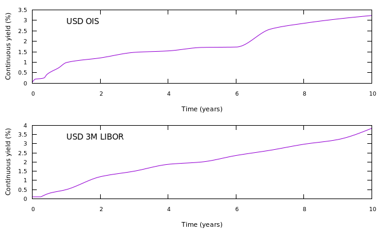

=====================================================
Simultaneous and consecutive multi-curve construction
=====================================================

The code for this example can be found here_.

This example builds two curves; *USD OIS*, a USD overnight curve that is also used for discounting payments, and *USD 3M LIBOR*, a 3 month LIBOR curve that will calculate forward LIBOR rates. The model used is a discounting model.

Two models are used to demonstrate the difference between simultaneous and consecutive curve construction.
Simultaneous curve construction means that all curves are built at the same time, while consecutive means that one or more curves are constructed before any other curves, and used as an input into their construction. 

Simultaneous curve construction:

* has the advantage that it can be used for any types of instruments, so captures dependencies between curves (e.g. if basis swaps between different LIBOR tenors are used)
* has the disadvantage that the dimension of the root-finding problem is larger, and so calculations take longer and more data must be stored. In fact, the dimension is the total number of nodes used on all curves
* has the disadvantage that sensitivities are calculated for all curves against all other curves, even when there is by definition no sensitivity. For example, an overnight curve constructed using OIS swaps will have zero sensitivity to any LIBOR rates, but these values are calculated and stored

Consecutive curve construction:

* has the advantage that the dimension of the root-finding problem is reduced for all but the last curve to be constructed, and so the calculation takes less time and requires less data to be stored
* does not produce spurious sensitivity calculations when one curve by definition has no sensitivity to another (where we make a distinction between sensitivities that are not calculated, and sensitivities that are calculated but that are equal to zero)
* has the disadvantage that it cannot be used when curves are coupled e.g. through the use of basis swaps. However, this does not mean that all curves must be constructed simultaneously - you might decide to calculate the overnight and discounting curves first, then calculate any coupled curves afterwards

The process followed is:

* decide on the model to be used
* define the type (shape) of the curves
* define the build order and uses of the curves 
* add nodes to the curves
* build

**model, curve shape, and curve build order and use**
    The curves will be constructed in two ways, simultaneously and consecutively using a discounting model. The interpolator used for all curves is a monotonic constrained cubic spline.

    The simultaneous method uses both curve names in the ``building`` method to tell the curve builder that these curves should be constructed at the same time. 

    .. code-block:: java
    
        builder = DiscountingMethodCurveBuilder.setUp()
            .building("USD OIS", "USD 3M LIBOR")
            .using("USD OIS").forDiscounting(Currency.USD).forIndex(FED_FUNDS_INDEX).withInterpolator(INTERPOLATOR)
            .using("USD 3M LIBOR").forIndex(LIBOR_INDEX).withInterpolator(INTERPOLATOR);
    
    The consecutive method uses ``building().thenBuilding()`` to tell the curve builder to build *USD OIS* first, and then use that curve to construct *USD 3M LIBOR*.

    .. code-block:: java
    
        builder = DiscountingMethodCurveBuilder.setUp()
            .building("USD OIS")
            .thenBuilding("USD 3M LIBOR")
            .using("USD OIS").forDiscounting(Currency.USD).forIndex(FED_FUNDS_INDEX).withInterpolator(INTERPOLATOR)
            .using("USD 3M LIBOR").forIndex(LIBOR_INDEX).withInterpolator(INTERPOLATOR);
    
    Note that the ``using`` methods in both cases are the same. These methods tell the builder how the curves should be used i.e. that *USD OIS* should be used for discounting USD payments and for calculating forward rates for the Fed Funds index, and that *USD 3M LIBOR* should be used for calculating forward 3M LIBOR rates.
    
**add the node instruments**

    The instruments used on each curve are:

    * An overnight deposit and OIS on *USD OIS*
    * A 3m LIBOR deposit and fixed / 3m LIBOR swaps on *USD 3M LIBOR*

    Curve instrument generators are classes that take convention information such as day-counts, spot lag, etc., that is used to generate vanilla instruments that used in curve construction. It is, of course, possible to create the instruments directl. 

    The generators used for these curves are:

    .. code-block:: java

      overnight = OvernightDepositGenerator.builder()
          .withCurrency(Currency.USD)
          .withCalendar(WeekendWorkingDayCalendar.SATURDAY_SUNDAY)
          .withDayCount(DayCounts.ACT_360)
          .build();
      libor = IborGenerator.builder()
          .withCalendar(WeekendWorkingDayCalendar.SATURDAY_SUNDAY)
          .withIborIndex(LIBOR_INDEX)
          .build();
      ois = VanillaOisGenerator.builder()
          .withUnderlyingIndex(FED_FUNDS_INDEX)
          .withPaymentTenor(Tenor.ONE_YEAR)
          .withBusinessDayConvention(BusinessDayConventions.MODIFIED_FOLLOWING)
          .withEndOfMonth(EndOfMonthConvention.ADJUST_FOR_END_OF_MONTH)
          .withPaymentLag(2)
          .withSpotLag(2)
          .withStubType(StubType.SHORT_START)
          .withEndOfMonth(EndOfMonthConvention.IGNORE_END_OF_MONTH)
          .withCalendar(WeekendWorkingDayCalendar.SATURDAY_SUNDAY)
          .build();
      fixedLiborSwap = VanillaFixedIborSwapGenerator.builder()
          .withCalendar(WeekendWorkingDayCalendar.SATURDAY_SUNDAY)
          .withFixedLegDayCount(DayCounts.THIRTY_U_360)
          .withFixedLegPaymentTenor(Tenor.SIX_MONTHS)
          .withStub(StubType.SHORT_START)
          .withUnderlyingIndex(LIBOR_INDEX)
          .build();
    
    These generators are used to add nodes to the curves:

    .. code-block:: java

        builder.addNode("USD OIS", 
            overnight.toCurveInstrument(valuationDate, startTenor, Tenor.ON, 1, OVERNIGHT_QUOTE));
        IntStream.range(0, OIS_TENORS.length).forEach(
            i -> builder.addNode("USD OIS", 
                ois.toCurveInstrument(valuationDate, startTenor, OIS_TENORS[i], 1, OIS_QUOTES[i])));
        builder.addNode("USD 3M LIBOR", 
            libor.toCurveInstrument(valuationDate, startTenor, Tenor.THREE_MONTHS, 1, LIBOR_3M_QUOTE));
        IntStream.range(0, LIBOR_SWAP_TENORS.length).forEach(
            i -> builder.addNode("USD 3M LIBOR", 
                fixedLibor.toCurveInstrument(valuationDate, startTenor, LIBOR_SWAP_TENORS[i], 1, LIBOR_SWAP_QUOTES[i])));

========================

**The code**

.. code-block:: java

  // valuation date/time
  private static final LocalDate VALUATION_DATE = LocalDate.now();
  private static final LocalTime VALUATION_TIME = LocalTime.of(9, 0);
  private static final ZoneId VALUATION_ZONE = ZoneId.of("Europe/London");

  // get the interpolator that will be used for both curves
  private static final Interpolator1D INTERPOLATOR = NamedInterpolator1dFactory.of(
      MonotonicConstrainedCubicSplineInterpolator1dAdapter.NAME,
      FlatExtrapolator1dAdapter.NAME,
      LinearExtrapolator1dAdapter.NAME);

  // the underlying index objects for the swaps
  private static final OvernightIndex FED_FUNDS_INDEX = new OvernightIndex("FED FUNDS", Currency.USD, DayCounts.ACT_360, 1);
  private static final IborTypeIndex LIBOR_INDEX = new IborTypeIndex("3M USD LIBOR", Currency.USD, Tenor.THREE_MONTHS, 2, DayCounts.ACT_360,
      BusinessDayConventions.MODIFIED_FOLLOWING, true);

  // create the conventions for overnight and IBOR-type deposits, OIS swaps and IBOR swaps
  private static final OvernightDepositGenerator OVERNIGHT = OvernightDepositGenerator.builder()
      .withCurrency(Currency.USD)
      .withCalendar(WeekendWorkingDayCalendar.SATURDAY_SUNDAY)
      .withDayCount(DayCounts.ACT_360)
      .build();
  private static final IborGenerator LIBOR = IborGenerator.builder()
      .withCalendar(WeekendWorkingDayCalendar.SATURDAY_SUNDAY)
      .withIborIndex(LIBOR_INDEX)
      .build();
  private static final VanillaOisGenerator OIS = VanillaOisGenerator.builder()
      .withUnderlyingIndex(FED_FUNDS_INDEX)
      .withPaymentTenor(Tenor.ONE_YEAR)
      .withBusinessDayConvention(BusinessDayConventions.MODIFIED_FOLLOWING)
      .withEndOfMonth(EndOfMonthConvention.ADJUST_FOR_END_OF_MONTH)
      .withPaymentLag(2)
      .withSpotLag(2)
      .withStubType(StubType.SHORT_START)
      .withEndOfMonth(EndOfMonthConvention.IGNORE_END_OF_MONTH)
      .withCalendar(WeekendWorkingDayCalendar.SATURDAY_SUNDAY)
      .build();
  private static final VanillaFixedIborSwapGenerator FIXED_LIBOR = VanillaFixedIborSwapGenerator.builder()
      .withCalendar(WeekendWorkingDayCalendar.SATURDAY_SUNDAY)
      .withFixedLegDayCount(DayCounts.THIRTY_U_360)
      .withFixedLegPaymentTenor(Tenor.SIX_MONTHS)
      .withStub(StubType.SHORT_START)
      .withUnderlyingIndex(LIBOR_INDEX)
      .build();

  // the tenors of the OIS swaps
  private static final Tenor[] OIS_TENORS = new Tenor[] {
      Tenor.ONE_MONTH,
      Tenor.TWO_MONTHS,
      Tenor.THREE_MONTHS,
      Tenor.FOUR_MONTHS,
      Tenor.FIVE_MONTHS,
      Tenor.SIX_MONTHS,
      Tenor.NINE_MONTHS,
      Tenor.ONE_YEAR,
      Tenor.TWO_YEARS,
      Tenor.THREE_YEARS,
      Tenor.FOUR_YEARS,
      Tenor.FIVE_YEARS,
      Tenor.SIX_YEARS,
      Tenor.SEVEN_YEARS,
      Tenor.EIGHT_YEARS,
      Tenor.NINE_YEARS,
      Tenor.TEN_YEARS };
  // the tenors of the IBOR swaps
  private static final Tenor[] LIBOR_SWAP_TENORS = new Tenor[] {
      Tenor.SIX_MONTHS,
      Tenor.ONE_YEAR,
      Tenor.TWO_YEARS,
      Tenor.THREE_YEARS,
      Tenor.FOUR_YEARS,
      Tenor.FIVE_YEARS,
      Tenor.SIX_YEARS,
      Tenor.SEVEN_YEARS,
      Tenor.EIGHT_YEARS,
      Tenor.NINE_YEARS,
      Tenor.TEN_YEARS };
  // market quotes for the curve instruments
  private static final double OVERNIGHT_QUOTE = 0.0005;
  private static final double LIBOR_3M_QUOTE = 0.001;
  private static final double[] OIS_QUOTES = new double[] {
      0.002,
      0.0021,
      0.0022,
      0.0025,
      0.004,
      0.005,
      0.0071,
      0.0098,
      0.012,
      0.0146,
      0.0153,
      0.0169,
      0.0171,
      0.025,
      0.0276,
      0.0295,
      0.031 };
  private static final double[] LIBOR_SWAP_QUOTES = new double[] {
      0.003,
      0.005,
      0.012,
      0.015,
      0.0187,
      0.02,
      0.0234,
      0.0261,
      0.0291,
      0.0314,
      0.0367 };

  private static final String OIS_CURVE_NAME = "USD OIS";
  private static final String LIBOR_CURVE_NAME = "USD 3M LIBOR";

  public static void constructSimultaneousCurves(final PrintStream out) {
    final ZonedDateTime valuationDate = ZonedDateTime.of(VALUATION_DATE, VALUATION_TIME, VALUATION_ZONE);
    // first construct the builder
    // an interpolated OIS curve is used to discount USD payments and to calculate forward rates for any
    // floating payments linked to the Fed Funds rate
    // an interpolated LIBOR curve is used to calculate any forward rates linked to the 3 month LIBOR rate
    // both curves are built at the same time
    final DiscountingMethodCurveSetUp curveBuilder = DiscountingMethodCurveBuilder.setUp()
        .building(OIS_CURVE_NAME, LIBOR_CURVE_NAME)
        .using(OIS_CURVE_NAME).forDiscounting(Currency.USD).forIndex(FED_FUNDS_INDEX).withInterpolator(INTERPOLATOR)
        .using(LIBOR_CURVE_NAME).forIndex(LIBOR_INDEX).withInterpolator(INTERPOLATOR);
    // add the cash nodes to the builder
    final Tenor startTenor = Tenor.of(Period.ZERO);
    curveBuilder.addNode(OIS_CURVE_NAME, OVERNIGHT.toCurveInstrument(valuationDate, startTenor, Tenor.ON, 1, OVERNIGHT_QUOTE));
    curveBuilder.addNode(LIBOR_CURVE_NAME, LIBOR.toCurveInstrument(valuationDate, startTenor, Tenor.THREE_MONTHS, 1, LIBOR_3M_QUOTE));
    // add the OIS nodes
    IntStream.range(0, OIS_TENORS.length).forEach(
        i -> curveBuilder.addNode(OIS_CURVE_NAME, OIS.toCurveInstrument(valuationDate, startTenor, OIS_TENORS[i], 1, OIS_QUOTES[i])));
    IntStream.range(0, LIBOR_SWAP_TENORS.length).forEach(
        i -> curveBuilder.addNode(LIBOR_CURVE_NAME, FIXED_LIBOR.toCurveInstrument(valuationDate, startTenor, LIBOR_SWAP_TENORS[i], 1, LIBOR_SWAP_QUOTES[i])));
    // build the curves
    final Pair<MulticurveProviderDiscount, CurveBuildingBlockBundle> result = curveBuilder.getBuilder().buildCurves(valuationDate);
  }

  public static void constructConsecutiveCurves(final PrintStream out) {
    final ZonedDateTime valuationDate = ZonedDateTime.of(VALUATION_DATE, VALUATION_TIME, VALUATION_ZONE);
    // first construct the builder
    // an interpolated OIS curve is constructed first, which is used to discount USD payments and to calculate forward rates for any
    // floating payments linked to the Fed Funds rate
    // an interpolated LIBOR curve is then built, which is used to calculate any forward rates linked to the 3 month LIBOR rate
    final DiscountingMethodCurveSetUp curveBuilder = DiscountingMethodCurveBuilder.setUp()
        .building(OIS_CURVE_NAME)
        .using(OIS_CURVE_NAME).forDiscounting(Currency.USD).forIndex(FED_FUNDS_INDEX).withInterpolator(INTERPOLATOR)
        .thenBuilding(LIBOR_CURVE_NAME)
        .using(LIBOR_CURVE_NAME).forIndex(LIBOR_INDEX).withInterpolator(INTERPOLATOR);
    // add the cash nodes to the builder
    final Tenor startTenor = Tenor.of(Period.ZERO);
    curveBuilder.addNode(OIS_CURVE_NAME, OVERNIGHT.toCurveInstrument(valuationDate, startTenor, Tenor.ON, 1, OVERNIGHT_QUOTE));
    curveBuilder.addNode(LIBOR_CURVE_NAME, LIBOR.toCurveInstrument(valuationDate, startTenor, Tenor.THREE_MONTHS, 1, LIBOR_3M_QUOTE));
    // add the OIS nodes
    IntStream.range(0, OIS_TENORS.length).forEach(
        i -> curveBuilder.addNode(OIS_CURVE_NAME, OIS.toCurveInstrument(valuationDate, startTenor, OIS_TENORS[i], 1, OIS_QUOTES[i])));
    IntStream.range(0, LIBOR_SWAP_TENORS.length).forEach(
        i -> curveBuilder.addNode(LIBOR_CURVE_NAME, FIXED_LIBOR.toCurveInstrument(valuationDate, startTenor, LIBOR_SWAP_TENORS[i], 1, LIBOR_SWAP_QUOTES[i])));
    // build the curves
    final Pair<MulticurveProviderDiscount, CurveBuildingBlockBundle> result = curveBuilder.getBuilder().buildCurves(valuationDate);
  }

=================

**The output**

The curves generated simultaneously are:

|sim curve plot|

and those generated consecutively are:

|con curve plot|

The yields at the nodes are shown in the table below. As expected, the curves are identical for both calculation methods.

*USD OIS*

=========   ============    ========================    =======================
node        time (years)    yield (simultaneous) (%)    yield (consecutive) (%)
=========   ============    ========================    =======================
1           0.002732	           0.050833	                   0.050833	
2           0.095628	           0.198940                    0.198940		
3           0.177596            0.209196	                   0.209196	
4           0.265027	           0.222227	                   0.222227	
5           0.346995	           0.254335	                   0.254335	
6           0.428962            0.410525                    0.410525			
7           0.516393            0.513776                    0.513776			
8           0.765267            0.725081		              0.725081	
9           1.014582            0.990180	                   0.990180		
10          2.011842            1.211264		              1.211264	
11          3.009102            1.474005		              1.474005	
12          4.010929            1.544442		              1.544442	
13          5.009102            1.709419		              1.709419	
14          6.014582            1.728849		              1.728849	
15          7.014582	           2.584364	                   2.584364	
16          8.010929            2.865043		              2.865043	
17          9.009102	           3.071961	                   3.071961	
18          10.009102           3.237378                    3.237378
=========   ============    ========================    =======================

*USD 3M LIBOR*

=========   ============    ========================    =======================
node        time (years)    yield (simultaneous) (%)    yield (consecutive) (%)
=========   ============    ========================    =======================
1           0.254098	           0.101654	                   0.101654	
2           0.505464            0.297595                    0.297595			
3           1.003623            0.498364		              0.498364
4           2.000883	           1.199498	                   1.199498
5           2.998144	           1.502437	                   1.502437	
6           4.005464	           1.877758	                   1.877758
7           5.003623	           2.009127	                   2.009127	
8           6.003623            2.360077		              2.360077
9           7.003623            2.644399		              2.644399
10          8.000000	           2.974770	                   2.974770
11          9.003623	           3.233013	                   3.233013
12          10.003623           3.850637                    3.850637
=========   ============    ========================    =======================

The difference between the two calculation methods can be seen in the Jacobian matrices. The first matrix is the result of a simultaneous calculation of both curves:

* *USD OIS* has zero sensitivities to all instruments in the LIBOR curve
* *USD 3M LIBOR* has sensitivities to the instruments in *USD OIS* and to its instruments
* The curves are approximately lower triangular, i.e. a lower-tenor instrument has no sensitivity to a higher-tenor instrument. However, the interpolator is not completely local, so sensitivities can be distributed over adjacent nodes

.. raw:: html

    
    <table border="1" class="docutils">
    <table border="1" class="docutils">
    <caption>USD OIS</caption>
    <colgroup>
    <col width="3%" />
    <col width="3%" />
    <col width="3%" />
    <col width="3%" />
    <col width="3%" />
    <col width="3%" />
    <col width="3%" />
    <col width="3%" />
    <col width="3%" />
    <col width="3%" />
    <col width="3%" />
    <col width="3%" />
    <col width="3%" />
    <col width="3%" />
    <col width="3%" />
    <col width="3%" />
    <col width="3%" />
    <col width="3%" />
    <col width="3%" />
    <col width="3%" />
    <col width="3%" />
    <col width="3%" />
    <col width="3%" />
    <col width="3%" />
    <col width="3%" />
    <col width="3%" />
    <col width="3%" />
    <col width="3%" />
    <col width="3%" />
    </colgroup>
    <thead valign="bottom">
    <tr><th class="head"></th>
    <th colspan="18" class="head">USD OIS</th>
    <th colspan="12" class="head">USD 3M LIBOR</th>
    </tr>
    <tr>
    <td></td>
    <td><b>1</b></td>
    <td><b>2</b></td>
    <td><b>3</b></td>
    <td><b>4</b></td>
    <td><b>5</b></td>
    <td><b>6</b></td>
    <td><b>7</b></td>
    <td><b>8</b></td>
    <td><b>9</b></td>
    <td><b>10</b></td>
    <td><b>11</b></td>
    <td><b>12</b></td>
    <td><b>13</b></td>
    <td><b>14</b></td>
    <td><b>15</b></td>
    <td><b>16</b></td>
    <td><b>17</b></td>
    <td><b>18</b></td>
    <td><b>1</b></td>
    <td><b>2</b></td>
    <td><b>3</b></td>
    <td><b>4</b></td>
    <td><b>5</b></td>
    <td><b>6</b></td>
    <td><b>7</b></td>
    <td><b>8</b></td>
    <td><b>9</b></td>
    <td><b>10</b></td>
    <td><b>11</b></td>
    <td><b>12</b></td>
    </tr>
    </thead>
    <tbody valign="top">
    <tr><td>CASH 1D</td>
    <td>1.016665</td>
    <td>0</td>
    <td>0</td>
    <td>0</td>
    <td>0</td>
    <td>0</td>
    <td>0</td>
    <td>0</td>
    <td>0</td>
    <td>0</td>
    <td>0</td>
    <td>0</td>
    <td>0</td>
    <td>0</td>
    <td>0</td>
    <td>0</td>
    <td>0</td>
    <td>0</td>
    <td>0</td>
    <td>0</td>
    <td>0</td>
    <td>0</td>
    <td>0</td>
    <td>0</td>
    <td>0</td>
    <td>0</td>
    <td>0</td>
    <td>0</td>
    <td>0</td>
    <td>0</td>
    </tr>
    <tr><td>OIS 1M</td>
    <td>0.040432</td>
    <td>0.811453</td>
    <td>0.160342</td>
    <td>0.004178</td>
    <td>0.000071</td>
    <td>0</td>
    <td>0</td>
    <td>0</td>
    <td>0</td>
    <td>0</td>
    <td>0</td>
    <td>0</td>
    <td>0</td>
    <td>0</td>
    <td>0</td>
    <td>0</td>
    <td>0</td>
    <td>0</td>
    <td>0</td>
    <td>0</td>
    <td>0</td>
    <td>0</td>
    <td>0</td>
    <td>0</td>
    <td>0</td>
    <td>0</td>
    <td>0</td>
    <td>0</td>
    <td>0</td>
    <td>0</td>
    </tr>
    <tr><td>OIS 2M</td>
    <td>0.030310</td>
    <td>-0.030739</td>
    <td>0.990483</td>
    <td>0.025807</td>
    <td>0.000441</td>
    <td>0.000001</td>
    <td>0</td>
    <td>0</td>
    <td>0</td>
    <td>0</td>
    <td>0</td>
    <td>0</td>
    <td>0</td>
    <td>0</td>
    <td>0</td>
    <td>0</td>
    <td>0</td>
    <td>0</td>
    <td>0</td>
    <td>0</td>
    <td>0</td>
    <td>0</td>
    <td>0</td>
    <td>0</td>
    <td>0</td>
    <td>0</td>
    <td>0</td>
    <td>0</td>
    <td>0</td>
    <td>0</td>
    </tr>
    <tr><td>OIS 3M</td>
    <td>0.019477</td>
    <td>0.014546</td>
    <td>-0.163574</td>
    <td>1.126297</td>
    <td>0.019266</td>
    <td>0.000064</td>
    <td>0.000003</td>
    <td>0</td>
    <td>0</td>
    <td>0</td>
    <td>0</td>
    <td>0</td>
    <td>0</td>
    <td>0</td>
    <td>0</td>
    <td>0</td>
    <td>0</td>
    <td>0</td>
    <td>0</td>
    <td>0</td>
    <td>0</td>
    <td>0</td>
    <td>0</td>
    <td>0</td>
    <td>0</td>
    <td>0</td>
    <td>0</td>
    <td>0</td>
    <td>0</td>
    <td>0</td>
    </tr>
    <tr><td>OIS 4M</td>
    <td>0.015229</td>
    <td>-0.000619</td>
    <td>0.021385</td>
    <td>-0.118627</td>
    <td>1.094603</td>
    <td>0.003650</td>
    <td>0.000158</td>
    <td>0.000004</td>
    <td>0</td>
    <td>0</td>
    <td>0</td>
    <td>0</td>
    <td>0</td>
    <td>0</td>
    <td>0</td>
    <td>0</td>
    <td>0</td>
    <td>0</td>
    <td>0</td>
    <td>0</td>
    <td>0</td>
    <td>0</td>
    <td>0</td>
    <td>0</td>
    <td>0</td>
    <td>0</td>
    <td>0</td>
    <td>0</td>
    <td>0</td>
    <td>0</td>
    </tr>
    <tr><td>OIS 5M</td>
    <td>0.012423</td>
    <td>0.000891</td>
    <td>-0.001878</td>
    <td>0.010422</td>
    <td>-0.037663</td>
    <td>0.986869</td>
    <td>0.042834</td>
    <td>0.000988</td>
    <td>0.000015</td>
    <td>0</td>
    <td>0</td>
    <td>0</td>
    <td>0</td>
    <td>0</td>
    <td>0</td>
    <td>0</td>
    <td>0</td>
    <td>0</td>
    <td>0</td>
    <td>0</td>
    <td>0</td>
    <td>0</td>
    <td>0</td>
    <td>0</td>
    <td>0</td>
    <td>0</td>
    <td>0</td>
    <td>0</td>
    <td>0</td>
    <td>0</td>
    </tr>
    <tr><td>OIS 6M</td>
    <td>0.010327</td>
    <td>0.000617</td>
    <td>0.000041</td>
    <td>-0.001299</td>
    <td>0.007645</td>
    <td>-0.072401</td>
    <td>1.044570</td>
    <td>0.024103</td>
    <td>0.000378</td>
    <td>0.000005</td>
    <td>0</td>
    <td>0</td>
    <td>0</td>
    <td>0</td>
    <td>0</td>
    <td>0</td>
    <td>0</td>
    <td>0</td>
    <td>0</td>
    <td>0</td>
    <td>0</td>
    <td>0</td>
    <td>0</td>
    <td>0</td>
    <td>0</td>
    <td>0</td>
    <td>0</td>
    <td>0</td>
    <td>0</td>
    <td>0</td>
    </tr>
    <tr><td>OIS 8M</td>
    <td>0.006934</td>
    <td>0.000426</td>
    <td>-0.000129</td>
    <td>0.000057</td>
    <td>-0.000312</td>
    <td>0.004128</td>
    <td>-0.032846</td>
    <td>1.016370</td>
    <td>0.015937</td>
    <td>0.000221</td>
    <td>0</td>
    <td>0</td>
    <td>0</td>
    <td>0</td>
    <td>0</td>
    <td>0</td>
    <td>0</td>
    <td>0</td>
    <td>0</td>
    <td>0</td>
    <td>0</td>
    <td>0</td>
    <td>0</td>
    <td>0</td>
    <td>0</td>
    <td>0</td>
    <td>0</td>
    <td>0</td>
    <td>0</td>
    <td>0</td>
    </tr>
    <tr><td>OIS 1Y</td>
    <td>0.005259</td>
    <td>0.000323</td>
    <td>-0.000090</td>
    <td>-0.000004</td>
    <td>0.000011</td>
    <td>-0.000117</td>
    <td>0.001463</td>
    <td>-0.008488</td>
    <td>0.993558</td>
    <td>0.013789</td>
    <td>0.000062</td>
    <td>0</td>
    <td>0</td>
    <td>0</td>
    <td>0</td>
    <td>0</td>
    <td>0</td>
    <td>0</td>
    <td>0</td>
    <td>0</td>
    <td>0</td>
    <td>0</td>
    <td>0</td>
    <td>0</td>
    <td>0</td>
    <td>0</td>
    <td>0</td>
    <td>0</td>
    <td>0</td>
    <td>0</td>
    </tr>
    <tr><td>OIS 2Y</td>
    <td>0.002639</td>
    <td>0.000162</td>
    <td>-0.000045</td>
    <td>-0.000001</td>
    <td>0</td>
    <td>0.000001</td>
    <td>-0.000012</td>
    <td>0.000095</td>
    <td>-0.012722</td>
    <td>1.009068</td>
    <td>0.004525</td>
    <td>0.000061</td>
    <td>0</td>
    <td>0</td>
    <td>0</td>
    <td>0</td>
    <td>0</td>
    <td>0</td>
    <td>0</td>
    <td>0</td>
    <td>0</td>
    <td>0</td>
    <td>0</td>
    <td>0</td>
    <td>0</td>
    <td>0</td>
    <td>0</td>
    <td>0</td>
    <td>0</td>
    <td>0</td>
    </tr>
    <tr><td>OIS 3Y</td>
    <td>0.001768</td>
    <td>0.000109</td>
    <td>-0.000030</td>
    <td>0</td>
    <td>0</td>
    <td>0</td>
    <td>-0.000002</td>
    <td>0.000013</td>
    <td>-0.004915</td>
    <td>-0.011330</td>
    <td>1.003872</td>
    <td>0.013632</td>
    <td>0.000013</td>
    <td>0</td>
    <td>0</td>
    <td>0</td>
    <td>0</td>
    <td>0</td>
    <td>0</td>
    <td>0</td>
    <td>0</td>
    <td>0</td>
    <td>0</td>
    <td>0</td>
    <td>0</td>
    <td>0</td>
    <td>0</td>
    <td>0</td>
    <td>0</td>
    <td>0</td>
    </tr>
    <tr><td>OIS 4Y</td>
    <td>0.001326</td>
    <td>0.000081</td>
    <td>-0.000023</td>
    <td>0</td>
    <td>0</td>
    <td>0</td>
    <td>-0.000002</td>
    <td>0.000012</td>
    <td>-0.003930</td>
    <td>-0.007855</td>
    <td>-0.017238</td>
    <td>1.029302</td>
    <td>0.000999</td>
    <td>0.000009</td>
    <td>0</td>
    <td>0</td>
    <td>0</td>
    <td>0</td>
    <td>0</td>
    <td>0</td>
    <td>0</td>
    <td>0</td>
    <td>0</td>
    <td>0</td>
    <td>0</td>
    <td>0</td>
    <td>0</td>
    <td>0</td>
    <td>0</td>
    <td>0</td>
    </tr>
    <tr><td>OIS 5Y</td>
    <td>0.001062</td>
    <td>0.000065</td>
    <td>-0.000018</td>
    <td>0</td>
    <td>0</td>
    <td>0</td>
    <td>-0.000002</td>
    <td>0.000013</td>
    <td>-0.003494</td>
    <td>-0.007008</td>
    <td>-0.010417</td>
    <td>-0.014461</td>
    <td>1.028953</td>
    <td>0.009220</td>
    <td>0</td>
    <td>0</td>
    <td>0</td>
    <td>0</td>
    <td>0</td>
    <td>0</td>
    <td>0</td>
    <td>0</td>
    <td>0</td>
    <td>0</td>
    <td>0</td>
    <td>0</td>
    <td>0</td>
    <td>0</td>
    <td>0</td>
    <td>0</td>
    </tr>
    <tr><td>OIS 6Y</td>
    <td>0.000883</td>
    <td>0.000054</td>
    <td>-0.000015</td>
    <td>0</td>
    <td>0</td>
    <td>0</td>
    <td>-0.000002</td>
    <td>0.000011</td>
    <td>-0.002942</td>
    <td>-0.005902</td>
    <td>-0.008798</td>
    <td>-0.011970</td>
    <td>-0.037098</td>
    <td>1.068812</td>
    <td>0.000012</td>
    <td>0</td>
    <td>0</td>
    <td>0</td>
    <td>0</td>
    <td>0</td>
    <td>0</td>
    <td>0</td>
    <td>0</td>
    <td>0</td>
    <td>0</td>
    <td>0</td>
    <td>0</td>
    <td>0</td>
    <td>0</td>
    <td>0</td>
    </tr>
    <tr><td>OIS 7Y</td>
    <td>0.000759</td>
    <td>0.000047</td>
    <td>-0.000013</td>
    <td>0</td>
    <td>0</td>
    <td>0</td>
    <td>-0.000004</td>
    <td>0.000021</td>
    <td>-0.003887</td>
    <td>-0.007843</td>
    <td>-0.011627</td>
    <td>-0.015970</td>
    <td>-0.019482</td>
    <td>-0.026671</td>
    <td>1.090818</td>
    <td>0.014347</td>
    <td>0.000107</td>
    <td>0</td>
    <td>0</td>
    <td>0</td>
    <td>0</td>
    <td>0</td>
    <td>0</td>
    <td>0</td>
    <td>0</td>
    <td>0</td>
    <td>0</td>
    <td>0</td>
    <td>0</td>
    <td>0</td>
    </tr>
    <tr><td>OIS 8Y</td>
    <td>0.000664</td>
    <td>0.000041</td>
    <td>-0.000011</td>
    <td>0</td>
    <td>0</td>
    <td>0</td>
    <td>-0.000004</td>
    <td>0.000022</td>
    <td>-0.003831</td>
    <td>-0.007739</td>
    <td>-0.011461</td>
    <td>-0.015770</td>
    <td>-0.019434</td>
    <td>-0.024273</td>
    <td>-0.032607</td>
    <td>1.130828</td>
    <td>0.008417</td>
    <td>0.000030</td>
    <td>0</td>
    <td>0</td>
    <td>0</td>
    <td>0</td>
    <td>0</td>
    <td>0</td>
    <td>0</td>
    <td>0</td>
    <td>0</td>
    <td>0</td>
    <td>0</td>
    <td>0</td>
    </tr>
    <tr><td>OIS 9Y</td>
    <td>0.000591</td>
    <td>0.000036</td>
    <td>-0.000010</td>
    <td>0</td>
    <td>0</td>
    <td>0</td>
    <td>-0.000004</td>
    <td>0.000022</td>
    <td>-0.003703</td>
    <td>-0.007486</td>
    <td>-0.011077</td>
    <td>-0.015259</td>
    <td>-0.018757</td>
    <td>-0.023494</td>
    <td>-0.027034</td>
    <td>-0.032435</td>
    <td>1.162648</td>
    <td>0.004103</td>
    <td>0</td>
    <td>0</td>
    <td>0</td>
    <td>0</td>
    <td>0</td>
    <td>0</td>
    <td>0</td>
    <td>0</td>
    <td>0</td>
    <td>0</td>
    <td>0</td>
    <td>0</td>
    </tr>
    <tr><td>OIS 10Y</td>
    <td>0.000532</td>
    <td>0.000033</td>
    <td>-0.000009</td>
    <td>0</td>
    <td>0</td>
    <td>0</td>
    <td>-0.000004</td>
    <td>0.000022</td>
    <td>-0.003559</td>
    <td>-0.007198</td>
    <td>-0.010646</td>
    <td>-0.014677</td>
    <td>-0.018009</td>
    <td>-0.022586</td>
    <td>-0.025978</td>
    <td>-0.027451</td>
    <td>-0.042810</td>
    <td>1.203206</td>
    <td>0</td>
    <td>0</td>
    <td>0</td>
    <td>0</td>
    <td>0</td>
    <td>0</td>
    <td>0</td>
    <td>0</td>
    <td>0</td>
    <td>0</td>
    <td>0</td>
    <td>0</td>
    </tr>
    <tr><td>IBOR 3M</td>
    <td>0</td>
    <td>0</td>
    <td>0</td>
    <td>0</td>
    <td>0</td>
    <td>0</td>
    <td>0</td>
    <td>0</td>
    <td>0</td>
    <td>0</td>
    <td>0</td>
    <td>0</td>
    <td>0</td>
    <td>0</td>
    <td>0</td>
    <td>0</td>
    <td>0</td>
    <td>0</td>
    <td>1.016410</td>
    <td>0</td>
    <td>0</td>
    <td>0</td>
    <td>0</td>
    <td>0</td>
    <td>0</td>
    <td>0</td>
    <td>0</td>
    <td>0</td>
    <td>0</td>
    <td>0</td>
    </tr>
    <tr><td>IBOR SWAP 6M</td>
    <td>0</td>
    <td>0</td>
    <td>-0.000006</td>
    <td>0.000137</td>
    <td>0</td>
    <td>0</td>
    <td>-0.000263</td>
    <td>0</td>
    <td>0</td>
    <td>0</td>
    <td>0</td>
    <td>0</td>
    <td>0</td>
    <td>0</td>
    <td>0</td>
    <td>0</td>
    <td>0</td>
    <td>0</td>
    <td>0.010490</td>
    <td>0.987958</td>
    <td>0.000001</td>
    <td>0</td>
    <td>0</td>
    <td>0</td>
    <td>0</td>
    <td>0</td>
    <td>0</td>
    <td>0</td>
    <td>0</td>
    <td>0</td>
    </tr>
    <tr><td>IBOR SWAP 1Y</td>
    <td>0</td>
    <td>0</td>
    <td>-0.000003</td>
    <td>0.000069</td>
    <td>0</td>
    <td>0</td>
    <td>-0.000639</td>
    <td>0.001138</td>
    <td>-0.000505</td>
    <td>0</td>
    <td>0</td>
    <td>0</td>
    <td>0</td>
    <td>0</td>
    <td>0</td>
    <td>0</td>
    <td>0</td>
    <td>0</td>
    <td>0.005455</td>
    <td>-0.002935</td>
    <td>0.996499</td>
    <td>0.000050</td>
    <td>0</td>
    <td>0</td>
    <td>0</td>
    <td>0</td>
    <td>0</td>
    <td>0</td>
    <td>0</td>
    <td>0</td>
    </tr>
    <tr><td>IBOR SWAP 2Y</td>
    <td>0</td>
    <td>0</td>
    <td>-0.000001</td>
    <td>0.000035</td>
    <td>0</td>
    <td>0</td>
    <td>-0.001212</td>
    <td>0.000456</td>
    <td>-0.000082</td>
    <td>0.003914</td>
    <td>-0.000262</td>
    <td>-0.000004</td>
    <td>0</td>
    <td>0</td>
    <td>0</td>
    <td>0</td>
    <td>0</td>
    <td>0</td>
    <td>0.002739</td>
    <td>-0.000533</td>
    <td>-0.005392</td>
    <td>0.998622</td>
    <td>0.000798</td>
    <td>0</td>
    <td>0</td>
    <td>0</td>
    <td>0</td>
    <td>0</td>
    <td>0</td>
    <td>0</td>
    </tr>
    <tr><td>IBOR SWAP 3Y</td>
    <td>0</td>
    <td>0</td>
    <td>0</td>
    <td>0.000023</td>
    <td>0</td>
    <td>0</td>
    <td>-0.001071</td>
    <td>0.000333</td>
    <td>-0.001235</td>
    <td>0.004239</td>
    <td>0.002583</td>
    <td>-0.000699</td>
    <td>0</td>
    <td>0</td>
    <td>0</td>
    <td>0</td>
    <td>0</td>
    <td>0</td>
    <td>0.001828</td>
    <td>-0.000356</td>
    <td>-0.003366</td>
    <td>-0.012529</td>
    <td>1.009698</td>
    <td>0.000531</td>
    <td>0</td>
    <td>0</td>
    <td>0</td>
    <td>0</td>
    <td>0</td>
    <td>0</td>
    </tr>
    <tr><td>IBOR SWAP 4Y</td>
    <td>0</td>
    <td>0</td>
    <td>0</td>
    <td>0.000017</td>
    <td>0</td>
    <td>0</td>
    <td>-0.001048</td>
    <td>0.000274</td>
    <td>-0.001644</td>
    <td>0.000951</td>
    <td>0.005025</td>
    <td>0.004574</td>
    <td>-0.000201</td>
    <td>-0.000003</td>
    <td>0</td>
    <td>0</td>
    <td>0</td>
    <td>0</td>
    <td>0.001368</td>
    <td>-0.000266</td>
    <td>-0.002520</td>
    <td>-0.008703</td>
    <td>-0.012918</td>
    <td>1.016222</td>
    <td>0.001478</td>
    <td>0</td>
    <td>0</td>
    <td>0</td>
    <td>0</td>
    <td>0</td>
    </tr>
    <tr><td>IBOR SWAP 5Y</td>
    <td>0</td>
    <td>0</td>
    <td>0</td>
    <td>0.000014</td>
    <td>0</td>
    <td>0</td>
    <td>-0.000909</td>
    <td>0.000226</td>
    <td>-0.001525</td>
    <td>0.000156</td>
    <td>0.002501</td>
    <td>0.007268</td>
    <td>0.001794</td>
    <td>-0.001031</td>
    <td>0</td>
    <td>0</td>
    <td>0</td>
    <td>0</td>
    <td>0.001095</td>
    <td>-0.000213</td>
    <td>-0.002017</td>
    <td>-0.006966</td>
    <td>-0.010101</td>
    <td>-0.020316</td>
    <td>1.032504</td>
    <td>0.000252</td>
    <td>0</td>
    <td>0</td>
    <td>0</td>
    <td>0</td>
    </tr>
    <tr><td>IBOR SWAP 6Y</td>
    <td>0</td>
    <td>0</td>
    <td>0</td>
    <td>0.000012</td>
    <td>0</td>
    <td>0</td>
    <td>-0.000915</td>
    <td>0.000204</td>
    <td>-0.001737</td>
    <td>-0.001224</td>
    <td>0.000245</td>
    <td>0.003346</td>
    <td>0.007624</td>
    <td>0.007881</td>
    <td>0.000006</td>
    <td>-0.000001</td>
    <td>0</td>
    <td>0</td>
    <td>0.000913</td>
    <td>-0.000178</td>
    <td>-0.001681</td>
    <td>-0.005806</td>
    <td>-0.008420</td>
    <td>-0.015862</td>
    <td>-0.014375</td>
    <td>1.037731</td>
    <td>0.000785</td>
    <td>0.000002</td>
    <td>0</td>
    <td>0</td>
    </tr>
    <tr><td>IBOR SWAP 7Y</td>
    <td>0</td>
    <td>0</td>
    <td>0</td>
    <td>0.000010</td>
    <td>0</td>
    <td>0</td>
    <td>-0.000897</td>
    <td>0.000185</td>
    <td>-0.001831</td>
    <td>-0.002035</td>
    <td>-0.001133</td>
    <td>0.000927</td>
    <td>0.000513</td>
    <td>0.017808</td>
    <td>0.009987</td>
    <td>-0.001883</td>
    <td>-0.000019</td>
    <td>0</td>
    <td>0.000782</td>
    <td>-0.000152</td>
    <td>-0.001441</td>
    <td>-0.004977</td>
    <td>-0.007217</td>
    <td>-0.013600</td>
    <td>-0.009632</td>
    <td>-0.050655</td>
    <td>1.074954</td>
    <td>0.003013</td>
    <td>0.000007</td>
    <td>0</td>
    </tr>
    <tr><td>IBOR SWAP 8Y</td>
    <td>0</td>
    <td>0</td>
    <td>0</td>
    <td>0.000009</td>
    <td>0</td>
    <td>0</td>
    <td>-0.000901</td>
    <td>0.000174</td>
    <td>-0.001980</td>
    <td>-0.002847</td>
    <td>-0.002448</td>
    <td>-0.001292</td>
    <td>-0.001965</td>
    <td>0.012025</td>
    <td>0.016953</td>
    <td>0.014784</td>
    <td>-0.001604</td>
    <td>-0.000009</td>
    <td>0.000685</td>
    <td>-0.000133</td>
    <td>-0.001262</td>
    <td>-0.004357</td>
    <td>-0.006319</td>
    <td>-0.011907</td>
    <td>-0.008439</td>
    <td>-0.042274</td>
    <td>-0.062609</td>
    <td>1.123710</td>
    <td>0.002498</td>
    <td>0.000001</td>
    </tr>
    <tr><td>IBOR SWAP 9Y</td>
    <td>0</td>
    <td>0</td>
    <td>0</td>
    <td>0.000008</td>
    <td>0</td>
    <td>0</td>
    <td>-0.000884</td>
    <td>0.000163</td>
    <td>-0.002035</td>
    <td>-0.003306</td>
    <td>-0.003237</td>
    <td>-0.002680</td>
    <td>-0.003520</td>
    <td>0.008345</td>
    <td>0.011583</td>
    <td>0.023150</td>
    <td>0.012218</td>
    <td>-0.001361</td>
    <td>0.000609</td>
    <td>-0.000118</td>
    <td>-0.001121</td>
    <td>-0.003871</td>
    <td>-0.005614</td>
    <td>-0.010578</td>
    <td>-0.007497</td>
    <td>-0.037561</td>
    <td>-0.054131</td>
    <td>-0.051209</td>
    <td>1.159566</td>
    <td>0.000669</td>
    </tr>
    <tr><td>IBOR SWAP 10Y</td>
    <td>0</td>
    <td>0</td>
    <td>0</td>
    <td>0.000007</td>
    <td>0</td>
    <td>0</td>
    <td>-0.000974</td>
    <td>0.000165</td>
    <td>-0.002442</td>
    <td>-0.004678</td>
    <td>-0.005246</td>
    <td>-0.005778</td>
    <td>-0.007064</td>
    <td>0.002373</td>
    <td>0.004736</td>
    <td>0.011013</td>
    <td>0.036233</td>
    <td>0.036604</td>
    <td>0.000548</td>
    <td>-0.000107</td>
    <td>-0.001009</td>
    <td>-0.003485</td>
    <td>-0.005053</td>
    <td>-0.009522</td>
    <td>-0.006749</td>
    <td>-0.033810</td>
    <td>-0.048732</td>
    <td>-0.041464</td>
    <td>-0.044906</td>
    <td>1.181606</td>
    </tr>
    </tbody>
    </table>
    

    </body>
    </html>

The next matrix is the result of a consecutive calculation of both curves:

* There were no sensitivities calculated for instruments in *USD OIS* to nodes in *USD 3M LIBOR* 
* *USD 3M LIBOR* has sensitivities to the instruments in *USD OIS* and to its instruments
* The values of the sensitivities are the same as those in the Jacobian for the simultaneous calculation

.. raw:: html

    
    <table border="1" class="docutils">
    <table border="1" class="docutils">
    <caption>USD OIS</caption>
    <colgroup>
    <col width="3%" />
    <col width="3%" />
    <col width="3%" />
    <col width="3%" />
    <col width="3%" />
    <col width="3%" />
    <col width="3%" />
    <col width="3%" />
    <col width="3%" />
    <col width="3%" />
    <col width="3%" />
    <col width="3%" />
    <col width="3%" />
    <col width="3%" />
    <col width="3%" />
    <col width="3%" />
    <col width="3%" />
    <col width="3%" />
    <col width="3%" />
    <col width="3%" />
    <col width="3%" />
    <col width="3%" />
    <col width="3%" />
    <col width="3%" />
    <col width="3%" />
    <col width="3%" />
    <col width="3%" />
    <col width="3%" />
    <col width="3%" />
    </colgroup>
    <thead valign="bottom">
    <tr><th class="head"></th>
    <th colspan="18" class="head">USD OIS</th>
    <th colspan="12" class="head">USD 3M LIBOR</th>
    </tr>
    <tr>
    <td></td>
    <td><b>1</b></td>
    <td><b>2</b></td>
    <td><b>3</b></td>
    <td><b>4</b></td>
    <td><b>5</b></td>
    <td><b>6</b></td>
    <td><b>7</b></td>
    <td><b>8</b></td>
    <td><b>9</b></td>
    <td><b>10</b></td>
    <td><b>11</b></td>
    <td><b>12</b></td>
    <td><b>13</b></td>
    <td><b>14</b></td>
    <td><b>15</b></td>
    <td><b>16</b></td>
    <td><b>17</b></td>
    <td><b>18</b></td>
    <td><b>1</b></td>
    <td><b>2</b></td>
    <td><b>3</b></td>
    <td><b>4</b></td>
    <td><b>5</b></td>
    <td><b>6</b></td>
    <td><b>7</b></td>
    <td><b>8</b></td>
    <td><b>9</b></td>
    <td><b>10</b></td>
    <td><b>11</b></td>
    <td><b>12</b></td>
    </tr>
    </thead>
    <tbody valign="top">
    <tr><td>CASH 1D</td>
    <td>1.016665</td>
    <td>0</td>
    <td>0</td>
    <td>0</td>
    <td>0</td>
    <td>0</td>
    <td>0</td>
    <td>0</td>
    <td>0</td>
    <td>0</td>
    <td>0</td>
    <td>0</td>
    <td>0</td>
    <td>0</td>
    <td>0</td>
    <td>0</td>
    <td>0</td>
    <td>0</td>
    <td>&nbsp;</td>
    <td>&nbsp;</td>
    <td>&nbsp;</td>
    <td>&nbsp;</td>
    <td>&nbsp;</td>
    <td>&nbsp;</td>
    <td>&nbsp;</td>
    <td>&nbsp;</td>
    <td>&nbsp;</td>
    <td>&nbsp;</td>
    <td>&nbsp;</td>
    <td>&nbsp;</td>
    </tr>
    <tr><td>OIS 1M</td>
    <td>0.040432</td>
    <td>0.811453</td>
    <td>0.160342</td>
    <td>0.004178</td>
    <td>0.000071</td>
    <td>0</td>
    <td>0</td>
    <td>0</td>
    <td>0</td>
    <td>0</td>
    <td>0</td>
    <td>0</td>
    <td>0</td>
    <td>0</td>
    <td>0</td>
    <td>0</td>
    <td>0</td>
    <td>0</td>
    <td>&nbsp;</td>
    <td>&nbsp;</td>
    <td>&nbsp;</td>
    <td>&nbsp;</td>
    <td>&nbsp;</td>
    <td>&nbsp;</td>
    <td>&nbsp;</td>
    <td>&nbsp;</td>
    <td>&nbsp;</td>
    <td>&nbsp;</td>
    <td>&nbsp;</td>
    <td>&nbsp;</td>
    </tr>
    <tr><td>OIS 2M</td>
    <td>0.030310</td>
    <td>-0.030739</td>
    <td>0.990483</td>
    <td>0.025807</td>
    <td>0.000441</td>
    <td>0.000001</td>
    <td>0</td>
    <td>0</td>
    <td>0</td>
    <td>0</td>
    <td>0</td>
    <td>0</td>
    <td>0</td>
    <td>0</td>
    <td>0</td>
    <td>0</td>
    <td>0</td>
    <td>0</td>
    <td>&nbsp;</td>
    <td>&nbsp;</td>
    <td>&nbsp;</td>
    <td>&nbsp;</td>
    <td>&nbsp;</td>
    <td>&nbsp;</td>
    <td>&nbsp;</td>
    <td>&nbsp;</td>
    <td>&nbsp;</td>
    <td>&nbsp;</td>
    <td>&nbsp;</td>
    <td>&nbsp;</td>
    </tr>
    <tr><td>OIS 3M</td>
    <td>0.019477</td>
    <td>0.014546</td>
    <td>-0.163574</td>
    <td>1.126297</td>
    <td>0.019266</td>
    <td>0.000064</td>
    <td>0.000003</td>
    <td>0</td>
    <td>0</td>
    <td>0</td>
    <td>0</td>
    <td>0</td>
    <td>0</td>
    <td>0</td>
    <td>0</td>
    <td>0</td>
    <td>0</td>
    <td>0</td>
    <td>&nbsp;</td>
    <td>&nbsp;</td>
    <td>&nbsp;</td>
    <td>&nbsp;</td>
    <td>&nbsp;</td>
    <td>&nbsp;</td>
    <td>&nbsp;</td>
    <td>&nbsp;</td>
    <td>&nbsp;</td>
    <td>&nbsp;</td>
    <td>&nbsp;</td>
    <td>&nbsp;</td>
    </tr>
    <tr><td>OIS 4M</td>
    <td>0.015229</td>
    <td>-0.000619</td>
    <td>0.021385</td>
    <td>-0.118627</td>
    <td>1.094603</td>
    <td>0.003650</td>
    <td>0.000158</td>
    <td>0.000004</td>
    <td>0</td>
    <td>0</td>
    <td>0</td>
    <td>0</td>
    <td>0</td>
    <td>0</td>
    <td>0</td>
    <td>0</td>
    <td>0</td>
    <td>0</td>
    <td>&nbsp;</td>
    <td>&nbsp;</td>
    <td>&nbsp;</td>
    <td>&nbsp;</td>
    <td>&nbsp;</td>
    <td>&nbsp;</td>
    <td>&nbsp;</td>
    <td>&nbsp;</td>
    <td>&nbsp;</td>
    <td>&nbsp;</td>
    <td>&nbsp;</td>
    <td>&nbsp;</td>
    </tr>
    <tr><td>OIS 5M</td>
    <td>0.012423</td>
    <td>0.000891</td>
    <td>-0.001878</td>
    <td>0.010422</td>
    <td>-0.037663</td>
    <td>0.986869</td>
    <td>0.042834</td>
    <td>0.000988</td>
    <td>0.000015</td>
    <td>0</td>
    <td>0</td>
    <td>0</td>
    <td>0</td>
    <td>0</td>
    <td>0</td>
    <td>0</td>
    <td>0</td>
    <td>0</td>
    <td>&nbsp;</td>
    <td>&nbsp;</td>
    <td>&nbsp;</td>
    <td>&nbsp;</td>
    <td>&nbsp;</td>
    <td>&nbsp;</td>
    <td>&nbsp;</td>
    <td>&nbsp;</td>
    <td>&nbsp;</td>
    <td>&nbsp;</td>
    <td>&nbsp;</td>
    <td>&nbsp;</td>
    </tr>
    <tr><td>OIS 6M</td>
    <td>0.010327</td>
    <td>0.000617</td>
    <td>0.000041</td>
    <td>-0.001299</td>
    <td>0.007645</td>
    <td>-0.072401</td>
    <td>1.044570</td>
    <td>0.024103</td>
    <td>0.000378</td>
    <td>0.000005</td>
    <td>0</td>
    <td>0</td>
    <td>0</td>
    <td>0</td>
    <td>0</td>
    <td>0</td>
    <td>0</td>
    <td>0</td>
    <td>&nbsp;</td>
    <td>&nbsp;</td>
    <td>&nbsp;</td>
    <td>&nbsp;</td>
    <td>&nbsp;</td>
    <td>&nbsp;</td>
    <td>&nbsp;</td>
    <td>&nbsp;</td>
    <td>&nbsp;</td>
    <td>&nbsp;</td>
    <td>&nbsp;</td>
    <td>&nbsp;</td>
    </tr>
    <tr><td>OIS 9M</td>
    <td>0.006934</td>
    <td>0.000426</td>
    <td>-0.000129</td>
    <td>0.000057</td>
    <td>-0.000312</td>
    <td>0.004128</td>
    <td>-0.032846</td>
    <td>1.016370</td>
    <td>0.015937</td>
    <td>0.000221</td>
    <td>0</td>
    <td>0</td>
    <td>0</td>
    <td>0</td>
    <td>0</td>
    <td>0</td>
    <td>0</td>
    <td>0</td>
    <td>&nbsp;</td>
    <td>&nbsp;</td>
    <td>&nbsp;</td>
    <td>&nbsp;</td>
    <td>&nbsp;</td>
    <td>&nbsp;</td>
    <td>&nbsp;</td>
    <td>&nbsp;</td>
    <td>&nbsp;</td>
    <td>&nbsp;</td>
    <td>&nbsp;</td>
    <td>&nbsp;</td>
    </tr>
    <tr><td>OIS 1Y</td>
    <td>0.005259</td>
    <td>0.000323</td>
    <td>-0.000090</td>
    <td>-0.000004</td>
    <td>0.000011</td>
    <td>-0.000117</td>
    <td>0.001463</td>
    <td>-0.008488</td>
    <td>0.993558</td>
    <td>0.013789</td>
    <td>0.000062</td>
    <td>0</td>
    <td>0</td>
    <td>0</td>
    <td>0</td>
    <td>0</td>
    <td>0</td>
    <td>0</td>
    <td>&nbsp;</td>
    <td>&nbsp;</td>
    <td>&nbsp;</td>
    <td>&nbsp;</td>
    <td>&nbsp;</td>
    <td>&nbsp;</td>
    <td>&nbsp;</td>
    <td>&nbsp;</td>
    <td>&nbsp;</td>
    <td>&nbsp;</td>
    <td>&nbsp;</td>
    <td>&nbsp;</td>
    </tr>
    <tr><td>OIS 2Y</td>
    <td>0.002639</td>
    <td>0.000162</td>
    <td>-0.000045</td>
    <td>-0.000001</td>
    <td>0</td>
    <td>0.000001</td>
    <td>-0.000012</td>
    <td>0.000095</td>
    <td>-0.012722</td>
    <td>1.009068</td>
    <td>0.004525</td>
    <td>0.000061</td>
    <td>0</td>
    <td>0</td>
    <td>0</td>
    <td>0</td>
    <td>0</td>
    <td>0</td>
    <td>&nbsp;</td>
    <td>&nbsp;</td>
    <td>&nbsp;</td>
    <td>&nbsp;</td>
    <td>&nbsp;</td>
    <td>&nbsp;</td>
    <td>&nbsp;</td>
    <td>&nbsp;</td>
    <td>&nbsp;</td>
    <td>&nbsp;</td>
    <td>&nbsp;</td>
    <td>&nbsp;</td>
    </tr>
    <tr><td>OIS 3Y</td>
    <td>0.001768</td>
    <td>0.000109</td>
    <td>-0.000030</td>
    <td>0</td>
    <td>0</td>
    <td>0</td>
    <td>-0.000002</td>
    <td>0.000013</td>
    <td>-0.004915</td>
    <td>-0.011330</td>
    <td>1.003872</td>
    <td>0.013632</td>
    <td>0.000013</td>
    <td>0</td>
    <td>0</td>
    <td>0</td>
    <td>0</td>
    <td>0</td>
    <td>&nbsp;</td>
    <td>&nbsp;</td>
    <td>&nbsp;</td>
    <td>&nbsp;</td>
    <td>&nbsp;</td>
    <td>&nbsp;</td>
    <td>&nbsp;</td>
    <td>&nbsp;</td>
    <td>&nbsp;</td>
    <td>&nbsp;</td>
    <td>&nbsp;</td>
    <td>&nbsp;</td>
    </tr>
    <tr><td>OIS 4Y</td>
    <td>0.001326</td>
    <td>0.000081</td>
    <td>-0.000023</td>
    <td>0</td>
    <td>0</td>
    <td>0</td>
    <td>-0.000002</td>
    <td>0.000012</td>
    <td>-0.003930</td>
    <td>-0.007855</td>
    <td>-0.017238</td>
    <td>1.029302</td>
    <td>0.000999</td>
    <td>0.000009</td>
    <td>0</td>
    <td>0</td>
    <td>0</td>
    <td>0</td>
    <td>&nbsp;</td>
    <td>&nbsp;</td>
    <td>&nbsp;</td>
    <td>&nbsp;</td>
    <td>&nbsp;</td>
    <td>&nbsp;</td>
    <td>&nbsp;</td>
    <td>&nbsp;</td>
    <td>&nbsp;</td>
    <td>&nbsp;</td>
    <td>&nbsp;</td>
    <td>&nbsp;</td>
    </tr>
    <tr><td>OIS 5Y</td>
    <td>0.001062</td>
    <td>0.000065</td>
    <td>-0.000018</td>
    <td>0</td>
    <td>0</td>
    <td>0</td>
    <td>-0.000002</td>
    <td>0.000013</td>
    <td>-0.003494</td>
    <td>-0.007008</td>
    <td>-0.010417</td>
    <td>-0.014461</td>
    <td>1.028953</td>
    <td>0.009220</td>
    <td>0</td>
    <td>0</td>
    <td>0</td>
    <td>0</td>
    <td>&nbsp;</td>
    <td>&nbsp;</td>
    <td>&nbsp;</td>
    <td>&nbsp;</td>
    <td>&nbsp;</td>
    <td>&nbsp;</td>
    <td>&nbsp;</td>
    <td>&nbsp;</td>
    <td>&nbsp;</td>
    <td>&nbsp;</td>
    <td>&nbsp;</td>
    <td>&nbsp;</td>
    </tr>
    <tr><td>OIS 6Y</td>
    <td>0.000883</td>
    <td>0.000054</td>
    <td>-0.000015</td>
    <td>0</td>
    <td>0</td>
    <td>0</td>
    <td>-0.000002</td>
    <td>0.000011</td>
    <td>-0.002942</td>
    <td>-0.005902</td>
    <td>-0.008798</td>
    <td>-0.011970</td>
    <td>-0.037098</td>
    <td>1.068812</td>
    <td>0.000012</td>
    <td>0</td>
    <td>0</td>
    <td>0</td>
    <td>&nbsp;</td>
    <td>&nbsp;</td>
    <td>&nbsp;</td>
    <td>&nbsp;</td>
    <td>&nbsp;</td>
    <td>&nbsp;</td>
    <td>&nbsp;</td>
    <td>&nbsp;</td>
    <td>&nbsp;</td>
    <td>&nbsp;</td>
    <td>&nbsp;</td>
    <td>&nbsp;</td>
    </tr>
    <tr><td>OIS 7Y</td>
    <td>0.000759</td>
    <td>0.000047</td>
    <td>-0.000013</td>
    <td>0</td>
    <td>0</td>
    <td>0</td>
    <td>-0.000004</td>
    <td>0.000021</td>
    <td>-0.003887</td>
    <td>-0.007843</td>
    <td>-0.011627</td>
    <td>-0.015970</td>
    <td>-0.019482</td>
    <td>-0.026671</td>
    <td>1.090818</td>
    <td>0.014347</td>
    <td>0.000107</td>
    <td>0</td>
    <td>&nbsp;</td>
    <td>&nbsp;</td>
    <td>&nbsp;</td>
    <td>&nbsp;</td>
    <td>&nbsp;</td>
    <td>&nbsp;</td>
    <td>&nbsp;</td>
    <td>&nbsp;</td>
    <td>&nbsp;</td>
    <td>&nbsp;</td>
    <td>&nbsp;</td>
    <td>&nbsp;</td>
    </tr>
    <tr><td>OIS 8Y</td>
    <td>0.000664</td>
    <td>0.000041</td>
    <td>-0.000011</td>
    <td>0</td>
    <td>0</td>
    <td>0</td>
    <td>-0.000004</td>
    <td>0.000022</td>
    <td>-0.003831</td>
    <td>-0.007739</td>
    <td>-0.011461</td>
    <td>-0.015770</td>
    <td>-0.019434</td>
    <td>-0.024273</td>
    <td>-0.032607</td>
    <td>1.130828</td>
    <td>0.008417</td>
    <td>0.000030</td>
    <td>&nbsp;</td>
    <td>&nbsp;</td>
    <td>&nbsp;</td>
    <td>&nbsp;</td>
    <td>&nbsp;</td>
    <td>&nbsp;</td>
    <td>&nbsp;</td>
    <td>&nbsp;</td>
    <td>&nbsp;</td>
    <td>&nbsp;</td>
    <td>&nbsp;</td>
    <td>&nbsp;</td>
    </tr>
    <tr><td>OIS 9Y</td>
    <td>0.000591</td>
    <td>0.000036</td>
    <td>-0.000010</td>
    <td>0</td>
    <td>0</td>
    <td>0</td>
    <td>-0.000004</td>
    <td>0.000022</td>
    <td>-0.003703</td>
    <td>-0.007486</td>
    <td>-0.011077</td>
    <td>-0.015259</td>
    <td>-0.018757</td>
    <td>-0.023494</td>
    <td>-0.027034</td>
    <td>-0.032435</td>
    <td>1.162648</td>
    <td>0.004103</td>
    <td>&nbsp;</td>
    <td>&nbsp;</td>
    <td>&nbsp;</td>
    <td>&nbsp;</td>
    <td>&nbsp;</td>
    <td>&nbsp;</td>
    <td>&nbsp;</td>
    <td>&nbsp;</td>
    <td>&nbsp;</td>
    <td>&nbsp;</td>
    <td>&nbsp;</td>
    <td>&nbsp;</td>
    </tr>
    <tr><td>OIS 10Y</td>
    <td>0.000532</td>
    <td>0.000033</td>
    <td>-0.000009</td>
    <td>0</td>
    <td>0</td>
    <td>0</td>
    <td>-0.000004</td>
    <td>0.000022</td>
    <td>-0.003559</td>
    <td>-0.007198</td>
    <td>-0.010646</td>
    <td>-0.014677</td>
    <td>-0.018009</td>
    <td>-0.022586</td>
    <td>-0.025978</td>
    <td>-0.027451</td>
    <td>-0.042810</td>
    <td>1.203206</td>
    <td>&nbsp;</td>
    <td>&nbsp;</td>
    <td>&nbsp;</td>
    <td>&nbsp;</td>
    <td>&nbsp;</td>
    <td>&nbsp;</td>
    <td>&nbsp;</td>
    <td>&nbsp;</td>
    <td>&nbsp;</td>
    <td>&nbsp;</td>
    <td>&nbsp;</td>
    <td>&nbsp;</td>
    </tr>
    <tr><td>IBOR 3M</td>
    <td>0</td>
    <td>0</td>
    <td>0</td>
    <td>0</td>
    <td>0</td>
    <td>0</td>
    <td>0</td>
    <td>0</td>
    <td>0</td>
    <td>0</td>
    <td>0</td>
    <td>0</td>
    <td>0</td>
    <td>0</td>
    <td>0</td>
    <td>0</td>
    <td>0</td>
    <td>0</td>
    <td>1.016410</td>
    <td>0</td>
    <td>0</td>
    <td>0</td>
    <td>0</td>
    <td>0</td>
    <td>0</td>
    <td>0</td>
    <td>0</td>
    <td>0</td>
    <td>0</td>
    <td>0</td>
    </tr>
    <tr><td>IBOR SWAP 6M</td>
    <td>0</td>
    <td>0</td>
    <td>-0.000006</td>
    <td>0.000137</td>
    <td>0</td>
    <td>0</td>
    <td>-0.000263</td>
    <td>0</td>
    <td>0</td>
    <td>0</td>
    <td>0</td>
    <td>0</td>
    <td>0</td>
    <td>0</td>
    <td>0</td>
    <td>0</td>
    <td>0</td>
    <td>0</td>
    <td>0.010490</td>
    <td>0.987958</td>
    <td>0.000001</td>
    <td>0</td>
    <td>0</td>
    <td>0</td>
    <td>0</td>
    <td>0</td>
    <td>0</td>
    <td>0</td>
    <td>0</td>
    <td>0</td>
    </tr>
    <tr><td>IBOR SWAP 1Y</td>
    <td>0</td>
    <td>0</td>
    <td>-0.000003</td>
    <td>0.000069</td>
    <td>0</td>
    <td>0</td>
    <td>-0.000639</td>
    <td>0.001138</td>
    <td>-0.000505</td>
    <td>0</td>
    <td>0</td>
    <td>0</td>
    <td>0</td>
    <td>0</td>
    <td>0</td>
    <td>0</td>
    <td>0</td>
    <td>0</td>
    <td>0.005455</td>
    <td>-0.002935</td>
    <td>0.996499</td>
    <td>0.000050</td>
    <td>0</td>
    <td>0</td>
    <td>0</td>
    <td>0</td>
    <td>0</td>
    <td>0</td>
    <td>0</td>
    <td>0</td>
    </tr>
    <tr><td>IBOR SWAP 2Y</td>
    <td>0</td>
    <td>0</td>
    <td>-0.000001</td>
    <td>0.000035</td>
    <td>0</td>
    <td>0</td>
    <td>-0.001212</td>
    <td>0.000456</td>
    <td>-0.000082</td>
    <td>0.003914</td>
    <td>-0.000262</td>
    <td>-0.000004</td>
    <td>0</td>
    <td>0</td>
    <td>0</td>
    <td>0</td>
    <td>0</td>
    <td>0</td>
    <td>0.002739</td>
    <td>-0.000533</td>
    <td>-0.005392</td>
    <td>0.998622</td>
    <td>0.000798</td>
    <td>0</td>
    <td>0</td>
    <td>0</td>
    <td>0</td>
    <td>0</td>
    <td>0</td>
    <td>0</td>
    </tr>
    <tr><td>IBOR SWAP 3Y</td>
    <td>0</td>
    <td>0</td>
    <td>0</td>
    <td>0.000023</td>
    <td>0</td>
    <td>0</td>
    <td>-0.001071</td>
    <td>0.000333</td>
    <td>-0.001235</td>
    <td>0.004239</td>
    <td>0.002583</td>
    <td>-0.000699</td>
    <td>0</td>
    <td>0</td>
    <td>0</td>
    <td>0</td>
    <td>0</td>
    <td>0</td>
    <td>0.001828</td>
    <td>-0.000356</td>
    <td>-0.003366</td>
    <td>-0.012529</td>
    <td>1.009698</td>
    <td>0.000531</td>
    <td>0</td>
    <td>0</td>
    <td>0</td>
    <td>0</td>
    <td>0</td>
    <td>0</td>
    </tr>
    <tr><td>IBOR SWAP 4Y</td>
    <td>0</td>
    <td>0</td>
    <td>0</td>
    <td>0.000017</td>
    <td>0</td>
    <td>0</td>
    <td>-0.001048</td>
    <td>0.000274</td>
    <td>-0.001644</td>
    <td>0.000951</td>
    <td>0.005025</td>
    <td>0.004574</td>
    <td>-0.000201</td>
    <td>-0.000003</td>
    <td>0</td>
    <td>0</td>
    <td>0</td>
    <td>0</td>
    <td>0.001368</td>
    <td>-0.000266</td>
    <td>-0.002520</td>
    <td>-0.008703</td>
    <td>-0.012918</td>
    <td>1.016222</td>
    <td>0.001478</td>
    <td>0</td>
    <td>0</td>
    <td>0</td>
    <td>0</td>
    <td>0</td>
    </tr>
    <tr><td>IBOR SWAP 5Y</td>
    <td>0</td>
    <td>0</td>
    <td>0</td>
    <td>0.000014</td>
    <td>0</td>
    <td>0</td>
    <td>-0.000909</td>
    <td>0.000226</td>
    <td>-0.001525</td>
    <td>0.000156</td>
    <td>0.002501</td>
    <td>0.007268</td>
    <td>0.001794</td>
    <td>-0.001031</td>
    <td>0</td>
    <td>0</td>
    <td>0</td>
    <td>0</td>
    <td>0.001095</td>
    <td>-0.000213</td>
    <td>-0.002017</td>
    <td>-0.006966</td>
    <td>-0.010101</td>
    <td>-0.020316</td>
    <td>1.032504</td>
    <td>0.000252</td>
    <td>0</td>
    <td>0</td>
    <td>0</td>
    <td>0</td>
    </tr>
    <tr><td>IBOR SWAP 6Y</td>
    <td>0</td>
    <td>0</td>
    <td>0</td>
    <td>0.000012</td>
    <td>0</td>
    <td>0</td>
    <td>-0.000915</td>
    <td>0.000204</td>
    <td>-0.001737</td>
    <td>-0.001224</td>
    <td>0.000245</td>
    <td>0.003346</td>
    <td>0.007624</td>
    <td>0.007881</td>
    <td>0.000006</td>
    <td>-0.000001</td>
    <td>0</td>
    <td>0</td>
    <td>0.000913</td>
    <td>-0.000178</td>
    <td>-0.001681</td>
    <td>-0.005806</td>
    <td>-0.008420</td>
    <td>-0.015862</td>
    <td>-0.014375</td>
    <td>1.037731</td>
    <td>0.000785</td>
    <td>0.000002</td>
    <td>0</td>
    <td>0</td>
    </tr>
    <tr><td>IBOR SWAP 7Y</td>
    <td>0</td>
    <td>0</td>
    <td>0</td>
    <td>0.000010</td>
    <td>0</td>
    <td>0</td>
    <td>-0.000897</td>
    <td>0.000185</td>
    <td>-0.001831</td>
    <td>-0.002035</td>
    <td>-0.001133</td>
    <td>0.000927</td>
    <td>0.000513</td>
    <td>0.017808</td>
    <td>0.009987</td>
    <td>-0.001883</td>
    <td>-0.000019</td>
    <td>0</td>
    <td>0.000782</td>
    <td>-0.000152</td>
    <td>-0.001441</td>
    <td>-0.004977</td>
    <td>-0.007217</td>
    <td>-0.013600</td>
    <td>-0.009632</td>
    <td>-0.050655</td>
    <td>1.074954</td>
    <td>0.003013</td>
    <td>0.000007</td>
    <td>0</td>
    </tr>
    <tr><td>IBOR SWAP 8Y</td>
    <td>0</td>
    <td>0</td>
    <td>0</td>
    <td>0.000009</td>
    <td>0</td>
    <td>0</td>
    <td>-0.000901</td>
    <td>0.000174</td>
    <td>-0.001980</td>
    <td>-0.002847</td>
    <td>-0.002448</td>
    <td>-0.001292</td>
    <td>-0.001965</td>
    <td>0.012025</td>
    <td>0.016953</td>
    <td>0.014784</td>
    <td>-0.001604</td>
    <td>-0.000009</td>
    <td>0.000685</td>
    <td>-0.000133</td>
    <td>-0.001262</td>
    <td>-0.004357</td>
    <td>-0.006319</td>
    <td>-0.011907</td>
    <td>-0.008439</td>
    <td>-0.042274</td>
    <td>-0.062609</td>
    <td>1.123710</td>
    <td>0.002498</td>
    <td>0.000001</td>
    </tr>
    <tr><td>IBOR SWAP 9Y</td>
    <td>0</td>
    <td>0</td>
    <td>0</td>
    <td>0.000008</td>
    <td>0</td>
    <td>0</td>
    <td>-0.000884</td>
    <td>0.000163</td>
    <td>-0.002035</td>
    <td>-0.003306</td>
    <td>-0.003237</td>
    <td>-0.002680</td>
    <td>-0.003520</td>
    <td>0.008345</td>
    <td>0.011583</td>
    <td>0.023150</td>
    <td>0.012218</td>
    <td>-0.001361</td>
    <td>0.000609</td>
    <td>-0.000118</td>
    <td>-0.001121</td>
    <td>-0.003871</td>
    <td>-0.005614</td>
    <td>-0.010578</td>
    <td>-0.007497</td>
    <td>-0.037561</td>
    <td>-0.054131</td>
    <td>-0.051209</td>
    <td>1.159566</td>
    <td>0.000669</td>
    </tr>
    <tr><td>IBOR SWAP 10Y</td>
    <td>0</td>
    <td>0</td>
    <td>0</td>
    <td>0.000007</td>
    <td>0</td>
    <td>0</td>
    <td>-0.000974</td>
    <td>0.000165</td>
    <td>-0.002442</td>
    <td>-0.004678</td>
    <td>-0.005246</td>
    <td>-0.005778</td>
    <td>-0.007064</td>
    <td>0.002373</td>
    <td>0.004736</td>
    <td>0.011013</td>
    <td>0.036233</td>
    <td>0.036604</td>
    <td>0.000548</td>
    <td>-0.000107</td>
    <td>-0.001009</td>
    <td>-0.003485</td>
    <td>-0.005053</td>
    <td>-0.009522</td>
    <td>-0.006749</td>
    <td>-0.033810</td>
    <td>-0.048732</td>
    <td>-0.041464</td>
    <td>-0.044906</td>
    <td>1.181606</td>
    </tr>
    </tbody>
    </table>

.. _here: https://github.com/McLeodMoores/starling/blob/curve/projects/analytics/src/main/java/com/mcleodmoores/analytics/examples/curveconstruction/OisDiscountingLiborCurveExample.java

