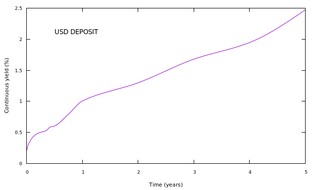

==============================
A simple deposit curve example
==============================

The code for this example can be found here_.

This example builds a single USD curve called *USD DEPOSIT* from cash deposit rates. The process is:

* decide on the model to be used
* define the type (shape) of the curve
* define the use of the curve
* add nodes to the curve
* build

model
    The model that will be used is a discounting model. The root-finder finds the spread over the deposit rate that     makes the cash instruments price to zero.

.. code-block:: java

    builder = DiscountingMethodCurveBuilder.setUp()

curve shape
    The curve is an interpolated curve, using a monotonic constrained cubic spline interpolator with flat left extrapolation and linear right extrapolation. 

.. code-block:: java

  interpolator = NamedInterpolator1dFactory.of(
      MonotonicConstrainedCubicSplineInterpolator1dAdapter.NAME,
      FlatExtrapolator1dAdapter.NAME,
      LinearExtrapolator1dAdapter.NAME);

curve use
    The curve will be used to discount all USD payments.

.. code-block:: java

  builder.building("USD DEPOSIT").using("USD DEPOSIT").forDiscounting(Currency.USD).withInterpolator(interpolator)

generate the nodal instruments
    The cash instruments can be created by calling CashDefinition_ directly. However, it's often easier to use an instrument generator, which stores the conventions used for all instruments and generates new instruments with different tenors and market data.

For example, instruments for this curve can be generated using

.. code-block:: java

  generator = CashGenerator.builder()
      .withCurrency(Currency.USD)
      .withBusinessDayConvention(BusinessDayConventions.MODIFIED_FOLLOWING)
      .withCalendar(WeekendWorkingDayCalendar.SATURDAY_SUNDAY)
      .withDayCount(DayCounts.ACT_360)
      .withEndOfMonthConvention(EndOfMonthConvention.IGNORE_END_OF_MONTH)
      .withSpotLag(2)
      .build();

add nodes to the curve
    The nodes are then added to the builder:

.. code-block:: java

  builder.addNode("USD DEPOSIT", generator.toCurveInstrument(valuationDate, startTenor, endTenor, marketQuote))

=====

**The code**

.. code-block:: java

  // valuation date/time
  private static final LocalDate VALUATION_DATE = LocalDate.now();
  private static final LocalTime VALUATION_TIME = LocalTime.of(9, 0);
  private static final ZoneId VALUATION_ZONE = ZoneId.of("Europe/London");
  
  // get the interpolator
  private static final Interpolator1D INTERPOLATOR = NamedInterpolator1dFactory.of(
      MonotonicConstrainedCubicSplineInterpolator1dAdapter.NAME,
      FlatExtrapolator1dAdapter.NAME,
      LinearExtrapolator1dAdapter.NAME);

  // contains conventions for USD deposit instruments and will generate instruments
  private static final CashGenerator CASH_CONVENTION = CashGenerator.builder()
      .withCurrency(Currency.USD)
      .withBusinessDayConvention(BusinessDayConventions.MODIFIED_FOLLOWING)
      .withCalendar(WeekendWorkingDayCalendar.SATURDAY_SUNDAY)
      .withDayCount(DayCounts.ACT_360)
      .withEndOfMonthConvention(EndOfMonthConvention.IGNORE_END_OF_MONTH)
      .withSpotLag(2)
      .build();

  // the tenors of the deposit instruments that will be used
  private static final Tenor[] CURVE_TENORS = new Tenor[] {
      Tenor.ON,
      Tenor.ONE_WEEK,
      Tenor.TWO_WEEKS,
      Tenor.THREE_WEEKS,
      Tenor.ONE_MONTH,
      Tenor.TWO_MONTHS,
      Tenor.THREE_MONTHS,
      Tenor.FOUR_MONTHS,
      Tenor.FIVE_MONTHS,
      Tenor.SIX_MONTHS,
      Tenor.NINE_MONTHS,
      Tenor.ONE_YEAR,
      Tenor.TWO_YEARS,
      Tenor.THREE_YEARS,
      Tenor.FOUR_YEARS,
      Tenor.FIVE_YEARS };

  // the market quotes of the instruments
  private static final double[] MARKET_QUOTES = new double[] {
      0.002,
      0.003,
      0.0034,
      0.0036,
      0.004,
      0.0047,
      0.005,
      0.0052,
      0.0058,
      0.006,
      0.0079,
      0.01,
      0.013,
      0.017,
      0.02,
      0.026 };

  // the curve name
  private static final String CURVE_NAME = "USD DEPOSIT";

  public static void constructCurve() {
    final ZonedDateTime valuationDate = ZonedDateTime.of(VALUATION_DATE, VALUATION_TIME, VALUATION_ZONE);
    // first construct the builder
    final DiscountingMethodCurveSetUp curveBuilder = DiscountingMethodCurveBuilder.setUp()
        .building(CURVE_NAME)
        .using(CURVE_NAME).forDiscounting(Currency.USD).withInterpolator(INTERPOLATOR);
    // add the nodes to the builder
    IntStream.range(0, CURVE_TENORS.length).forEach(
        i -> curveBuilder.addNode(CURVE_NAME, 
                 CASH_CONVENTION.toCurveInstrument(valuationDate, 
                                                   Tenor.of(Period.ZERO), 
                                                   CURVE_TENORS[i], 
                                                   1, 
                                                   MARKET_QUOTES[i])));
    // build the curves
    final Pair<MulticurveProviderDiscount, CurveBuildingBlockBundle> result = 
        curveBuilder.getBuilder().buildCurves(valuationDate);

The result is a data bundle that contains the curves and an object that contains sensitivity (sensitivity of the curve to the yield) information.

========

**The output**

|curve plot|

The yields at the nodes are shown in the table below.

USD DEPOSIT

========    ============    =========
node        time (years)    yield (%) 
========    ============    =========
1            0.002732        0.203333  
2            0.024590        0.284928 
3            0.043716        0.329276  
4            0.062842	     0.352809   
5            0.087432	     0.394606	
6            0.172131	     0.469296   
7            0.254098	     0.501705   
8            0.344262	     0.523218   
9            0.423497	     0.584112   
10            0.505464	     0.604808   	
11            0.757040	     0.796301   
12            1.003616	     1.006318   
13            2.003616	     1.299220   
14            3.000876	     1.678932   
15            4.005464	     1.948649   
16            5.003616       2.476004  	
========    ============    =========

															
The inverse Jacobian matrix is shown below.

.. raw:: html

    <table border="1" class="docutils">
    <caption>USD DEPOSIT</caption>
    <colgroup>
    <col width="6%" />
    <col width="6%" />
    <col width="6%" />
    <col width="6%" />
    <col width="6%" />
    <col width="6%" />
    <col width="6%" />
    <col width="6%" />
    <col width="6%" />
    <col width="6%" />
    <col width="6%" />
    <col width="6%" />
    <col width="6%" />
    <col width="6%" />
    <col width="6%" />
    <col width="6%" />
    <col width="6%" />
    </colgroup>
    <thead valign="bottom">
    <tr><th class="head">instrument/node</th>
    <th class="head">1</th>
    <th class="head">2</th>
    <th class="head">3</th>
    <th class="head">4</th>
    <th class="head">5</th>
    <th class="head">6</th>
    <th class="head">7</th>
    <th class="head">8</th>
    <th class="head">9</th>
    <th class="head">10</th>
    <th class="head">11</th>
    <th class="head">12</th>
    <th class="head">13</th>
    <th class="head">14</th>
    <th class="head">15</th>
    <th class="head">16</th>
    </tr>
    </thead>
    <tbody valign="top">
    <tr><td>CASH 1D</td>
    <td>1.016661</td>
    <td>0</td>
    <td>0</td>
    <td>0</td>
    <td>0</td>
    <td>0</td>
    <td>0</td>
    <td>0</td>
    <td>0</td>
    <td>0</td>
    <td>0</td>
    <td>0</td>
    <td>0</td>
    <td>0</td>
    <td>0</td>
    <td>0</td>
    </tr>
    <tr><td>CASH 7D</td>
    <td>0.196233</td>
    <td>0.831433</td>
    <td>-0.011047</td>
    <td>0</td>
    <td>0</td>
    <td>0</td>
    <td>0</td>
    <td>0</td>
    <td>0</td>
    <td>0</td>
    <td>0</td>
    <td>0</td>
    <td>0</td>
    <td>0</td>
    <td>0</td>
    <td>0</td>
    </tr>
    <tr><td>CASH 14D</td>
    <td>0.110381</td>
    <td>0.022915</td>
    <td>0.883252</td>
    <td>0</td>
    <td>0</td>
    <td>0</td>
    <td>0</td>
    <td>0</td>
    <td>0</td>
    <td>0</td>
    <td>0</td>
    <td>0</td>
    <td>0</td>
    <td>0</td>
    <td>0</td>
    <td>0</td>
    </tr>
    <tr><td>CASH 21D</td>
    <td>0.076787</td>
    <td>0.015941</td>
    <td>-0.004323</td>
    <td>0.928066</td>
    <td>0</td>
    <td>0</td>
    <td>0</td>
    <td>0</td>
    <td>0</td>
    <td>0</td>
    <td>0</td>
    <td>0</td>
    <td>0</td>
    <td>0</td>
    <td>0</td>
    <td>0</td>
    </tr>
    <tr><td>CASH 1M</td>
    <td>0.055190</td>
    <td>0.011458</td>
    <td>-0.003107</td>
    <td>0</td>
    <td>0.952807</td>
    <td>0</td>
    <td>0</td>
    <td>0</td>
    <td>0</td>
    <td>0</td>
    <td>0</td>
    <td>0</td>
    <td>0</td>
    <td>0</td>
    <td>0</td>
    <td>0</td>
    </tr>
    <tr><td>CASH 2M</td>
    <td>0.028033</td>
    <td>0.005820</td>
    <td>-0.001578</td>
    <td>0</td>
    <td>0</td>
    <td>0.983608</td>
    <td>0</td>
    <td>0</td>
    <td>0</td>
    <td>0</td>
    <td>0</td>
    <td>0</td>
    <td>0</td>
    <td>0</td>
    <td>0</td>
    <td>0</td>
    </tr>
    <tr><td>CASH 3M</td>
    <td>0.018990</td>
    <td>0.003942</td>
    <td>-0.001069</td>
    <td>0</td>
    <td>0</td>
    <td>0</td>
    <td>0.993547</td>
    <td>0</td>
    <td>0</td>
    <td>0</td>
    <td>0</td>
    <td>0</td>
    <td>0</td>
    <td>0</td>
    <td>0</td>
    <td>0</td>
    </tr>
    <tr><td>CASH 4M</td>
    <td>0.014017</td>
    <td>0.002910</td>
    <td>-0.000789</td>
    <td>0</td>
    <td>0</td>
    <td>0</td>
    <td>0</td>
    <td>0.998740</td>
    <td>0</td>
    <td>0</td>
    <td>0</td>
    <td>0</td>
    <td>0</td>
    <td>0</td>
    <td>0</td>
    <td>0</td>
    </tr>
    <tr><td>CASH 5M</td>
    <td>0.011394</td>
    <td>0.002365</td>
    <td>-0.000641</td>
    <td>0</td>
    <td>0</td>
    <td>0</td>
    <td>0</td>
    <td>0</td>
    <td>1.001081</td>
    <td>0</td>
    <td>0</td>
    <td>0</td>
    <td>0</td>
    <td>0</td>
    <td>0</td>
    <td>0</td>
    </tr>
    <tr><td>CASH 6M</td>
    <td>0.009546</td>
    <td>0.001982</td>
    <td>-0.000537</td>
    <td>0</td>
    <td>0</td>
    <td>0</td>
    <td>0</td>
    <td>0</td>
    <td>0</td>
    <td>1.002618</td>
    <td>0</td>
    <td>0</td>
    <td>0</td>
    <td>0</td>
    <td>0</td>
    <td>0</td>
    </tr>
    <tr><td>CASH 9M</td>
    <td>0.006374</td>
    <td>0.001323</td>
    <td>-0.000359</td>
    <td>0</td>
    <td>0</td>
    <td>0</td>
    <td>0</td>
    <td>0</td>
    <td>0</td>
    <td>0</td>
    <td>1.002994</td>
    <td>0</td>
    <td>0</td>
    <td>0</td>
    <td>0</td>
    <td>0</td>
    </tr>
    <tr><td>CASH 12M</td>
    <td>0.004808</td>
    <td>0.000998</td>
    <td>-0.000271</td>
    <td>0</td>
    <td>0</td>
    <td>0</td>
    <td>0</td>
    <td>0</td>
    <td>0</td>
    <td>0</td>
    <td>0</td>
    <td>1.000096</td>
    <td>0</td>
    <td>0</td>
    <td>0</td>
    <td>0</td>
    </tr>
    <tr><td>CASH 24M</td>
    <td>0.002408</td>
    <td>0.000500</td>
    <td>-0.000136</td>
    <td>0</td>
    <td>0</td>
    <td>0</td>
    <td>0</td>
    <td>0</td>
    <td>0</td>
    <td>0</td>
    <td>0</td>
    <td>0</td>
    <td>0.986066</td>
    <td>0</td>
    <td>0</td>
    <td>0</td>
    </tr>
    <tr><td>CASH 35M</td>
    <td>0.001608</td>
    <td>0.000334</td>
    <td>-0.000091</td>
    <td>0</td>
    <td>0</td>
    <td>0</td>
    <td>0</td>
    <td>0</td>
    <td>0</td>
    <td>0</td>
    <td>0</td>
    <td>0</td>
    <td>0</td>
    <td>0.962922</td>
    <td>0</td>
    <td>0</td>
    </tr>
    <tr><td>CASH 48M</td>
    <td>0.001205</td>
    <td>0.000250</td>
    <td>-0.000068</td>
    <td>0</td>
    <td>0</td>
    <td>0</td>
    <td>0</td>
    <td>0</td>
    <td>0</td>
    <td>0</td>
    <td>0</td>
    <td>0</td>
    <td>0</td>
    <td>0</td>
    <td>0.937135</td>
    <td>0</td>
    </tr>
    <tr><td>CASH 60M</td>
    <td>0.000964</td>
    <td>0.000200</td>
    <td>-0.000054</td>
    <td>0</td>
    <td>0</td>
    <td>0</td>
    <td>0</td>
    <td>0</td>
    <td>0</td>
    <td>0</td>
    <td>0</td>
    <td>0</td>
    <td>0</td>
    <td>0</td>
    <td>0</td>
    <td>0.895601</td>
    </tr>
    </tbody>
    </table>
    
The cash instrument has an initial and final payment, so, as expected, there are sensitivities at the early nodes and at the maturity. The sensitivities are distributed
around the early nodes because the interpolation is not completely local. As the node points of the curve are defined to be at the maturity of the instrument, there is
no such distribution for the sensitivities at the maturity.

.. _here: https://github.com/McLeodMoores/starling/blob/curve/projects/analytics/src/main/java/com/mcleodmoores/analytics/examples/curveconstruction/CashDepositCurveExample.java

.. _CashDefinition: https://github.com/McLeodMoores/starling/blob/master/projects/analytics/src/main/java/com/opengamma/analytics/financial/instrument/cash/CashDefinition.java

